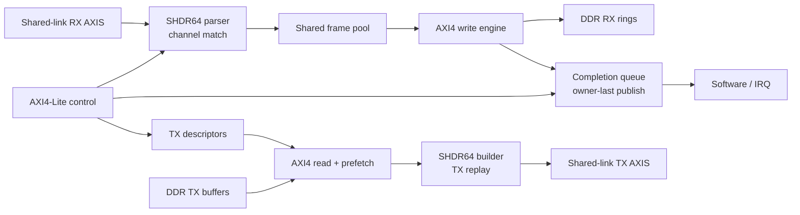

# SLVC DMA

[](https://github.com/ichigo-6301/slvc-dma-open/actions/workflows/public-integrity.yml)

[中文](README.md)

For source reading, see the [Chinese RTL reading guide](docs/zh-CN/rtl_reading_guide.md).
This refresh adds ordinary Chinese comments and reading documentation only; it does not
change RTL functional tokens, interfaces, QoR, or the frozen release tag.

SLVC DMA is a 512-bit virtual-channel DMA IP for a shared high-speed link.
Multiple upstream sources can be multiplexed into an SHDR64-framed segment
stream; the DMA moves payloads between the shared link and DDR rings according
to channel metadata, then publishes completion events to software through a
completion queue.

## Current Public Release

`v0.1.0-rc1` releases `slvc_dma_wrapper`, `frame_dma_wrapper`, the optional
carrier adapter, and the MCF companion. It freezes the 512-bit
Aurora-compatible profile together with its ModelSim/Questa regression and
Vivado 2018.3 OOC implementation entrypoint.

`v0.1.0-rc1` is a frozen tag. `main` may contain documentation, delivery, and
public-integrity updates that do not change the frozen tag target. See
[Release Notes](docs/en/release_notes.md).

This delivery branch also stages an **optional P0 Ethernet II / IPv4 / UDP RX
adapter**. It converts a fixed 512-bit packet AXI4-Stream profile into SHDR64
without modifying the frozen DMA core, register map, CQE ABI, or RC1 tag. See
the [UDP/IPv4 Adapter](docs/en/udp_ipv4_adapter.md) for the exact protocol and
nonclaim boundary.

The native path is `Aurora/native SHDR64 -> SLVC DMA`. The optional compatibility
path is `Ethernet II / IPv4 / UDP -> UDP-to-SHDR64 Adapter -> SLVC DMA`. The
adapter is controlled by `CONFIG_SLVC_DMA_UDP_IPV4_ADAPTER`; it is not a complete
Ethernet stack and does not provide UDP end-to-end flow control. The default
defconfig enables it, so simulation requires ten frozen-core markers plus four
adapter markers, fourteen total. Use
`configs/slvc_dma_512_core_only_defconfig` to require only the ten core markers.

## Stage Status

| Stage | Status | Public boundary |
| --- | --- | --- |
| Directed RTL regression | [verified](docs/en/verification_matrix.md) | Windows ModelSim and IC_EDA Questa completed the ten release-bound tests. |
| Optional adapter regression | [verified](docs/en/verification_matrix.md) | Four adapter tests passed on both simulator hosts. |
| FPGA OOC implementation | [verified](docs/en/results.md) | Three Vivado 2018.3 strategies met 200 MHz OOC setup and hold. |
| Adapter ASIC frontend | [verified](docs/en/udp_ipv4_adapter.md) | Adapter-only DC OOC met 5.000 ns; no physical/signoff claim. |
| Carrier CDC | [partial](docs/en/delivery_status.md) | Directed behavior is verified; complete CDC/RDC signoff is absent. |
| Full DMA ASIC frontend | [planned](docs/en/delivery_status.md) | Requires a separate library-bound profile and evidence. |
| Physical implementation | [blocked](docs/en/delivery_status.md) | Awaiting validated standard-cell and SRAM macro physical views. |
| Board validation | [not claimed](docs/en/delivery_status.md) | The exact public release commit has no board-level claim. |
| Lossless 10G operation | [not claimed](docs/en/delivery_status.md) | This release is not a board-level 10G production validation. |

## Features

- 512-bit shared-link AXI-Stream RX/TX data paths with 64-byte SHDR64 framing;
- RX header parsing, channel match/admission, shared frame pool, and DDR ring writes;
- Descriptor-driven TX payload reads, prefetch, SHDR64 rebuild, and shared-link replay;
- AXI4-Lite control for channels, descriptors, ring pointers, CQ, status, and IRQ;
- CQ body-first and owner/valid-last publication to prevent partial software reads;
- AXI/AXI-Stream backpressure, payload-writer prefetch, and local soft-reset control;
- Optional carrier CDC adapter and MCF companion endpoint for multi-source aggregation.
- Optional fixed-profile 512-bit Ethernet II / IPv4 / UDP RX-to-SHDR64 adapter.

## Architecture



`slvc_dma_wrapper` is the public system-integration top. `frame_dma_wrapper`
is the complete FPGA OOC timing top. The carrier adapter and MCF endpoint sit
at the DMA boundary and do not change DDR/CQ ownership semantics.

`dma_udp_ipv4_to_shdr64_adapter` can be placed immediately before the
shared-link RX input. It maps the UDP destination port to `SHDR64.flow_id` and
uses the unchanged DMA channel table for channel and DDR-context selection.

## Release Profile

| Item | `slvc_dma_v1_512` |
| --- | --- |
| Shared-link data width | 512 bit |
| Keep width | 64 bit |
| SHDR64 size | 64 byte |
| Maximum payload | 4096 byte |
| FPGA timing target | 200 MHz / 5.000 ns |
| FPGA device | `xc7z100ffg900-2` |
| OOC top | `frame_dma_wrapper` |

See [Interfaces](docs/en/interfaces.md) for control registers, descriptors,
CQEs, and ownership rules. The public RTL port lists are the authoritative
interface definitions.

## Verified Results

| Vivado 2018.3 strategy | WNS | WHS | LUT | FF | RAMB36 | RAMB18 | DSP |
| --- | ---: | ---: | ---: | ---: | ---: | ---: | ---: |
| Explore | +0.226 ns | +0.045 ns | 38,074 | 40,787 | 44 | 3 | 0 |
| Performance_Explore | +0.173 ns | +0.046 ns | 38,087 | 40,787 | 44 | 3 | 0 |
| ExtraNetDelay_high | +0.162 ns | +0.054 ns | 38,088 | 40,785 | 44 | 3 | 0 |

All three routed OOC runs have zero TNS and THS. The selected ten-test
directed regression passed with Windows ModelSim SE-64 2020.4 and IC_EDA Linux
Questa Sim-64 10.7c. The writer-prefetch smoke observed 48 contiguous 512-bit
AXI W beats in its specified long multi-burst case; this is not an end-to-end
lossless 10G throughput claim.

The optional adapter adds four tests on both simulator hosts: 18 directed
boundary/parser cases through 4096 bytes, 400 deterministic-random packets, a
23-case error/reset/stall matrix with 17 explicit invalid-packet drops and 23
successful accepts, and a two-channel adapter-to-DMA smoke. Its separate
Design Compiler OOC run met 5.000 ns with +0.39 ns WNS and 0 TNS; mapped
adapter-only area was 11744.32 library area units. This result excludes the DMA
core and is not physical-design or ASIC-signoff evidence.

See [Results](docs/en/results.md), [Verification](docs/en/verification.md), and
[`provenance/`](provenance/) for conditions, source commits, checksums, and
caveats.

## Quick Start

### 1. Configuration And Public Integrity

```text
python3 flows/scripts/flowctl.py defconfig --source configs/slvc_dma_512_defconfig
python3 flows/scripts/flowctl.py show-config
python3 flows/scripts/public_hygiene.py --root .
```

### 2. Simulator Regression

```text
python3 flows/scripts/flowctl.py sim-dry-run
python3 flows/scripts/flowctl.py sim
```

To run the frozen core without the optional adapter:

```text
python3 flows/scripts/flowctl.py defconfig --source configs/slvc_dma_512_core_only_defconfig
python3 flows/scripts/flowctl.py show-config
python3 flows/scripts/flowctl.py sim-dry-run
```

### 3. Vivado OOC Entrypoint

```text
python3 flows/scripts/flowctl.py fpga-ooc-dry-run
```

### 4. Optional Adapter-Only DC OOC Entrypoint

```text
python3 flows/scripts/flowctl.py adapter-dc-ooc-dry-run
```

The public runner requires Python 3.6 or newer. `sim` requires ModelSim or
Questa; `fpga-ooc` requires Vivado 2018.3. `adapter-dc-ooc` requires Design
Compiler and an untracked local standard-cell `.db`. GNU Make targets are convenience
wrappers. On Windows, replace `python3` with `python` when that command resolves
to Python 3.6 or newer. Keep tool paths and environment overrides under ignored
`flows/local/`. See the [Flow README](flows/README.md) for the complete command
set.

## Top Levels And Repository Layout

| Path | Contents |
| --- | --- |
| `rtl/include/` | Shared protocol, register, and profile definitions |
| `rtl/common/` | AXI-Stream register/FIFO, CDC FIFO, width packing, and RAM primitives |
| `rtl/rx/`, `rtl/tx/` | RX admission/write and descriptor-driven TX replay |
| `rtl/cq/`, `rtl/control/` | Completion Queue publication and AXI4-Lite/UFC control |
| `rtl/integration/` | Core integration, system wrappers, and the FPGA OOC top |
| `rtl/carrier/`, `rtl/adapters/` | Carrier/CDC/MCF/Aurora boundaries and optional packet adapters |
| `rtl/integration/slvc_dma_wrapper.v` | System-integration top |
| `rtl/integration/frame_dma_wrapper.v` | 200 MHz OOC timing top |
| `rtl/adapters/dma_udp_ipv4_to_shdr64_adapter.v` | Optional fixed-profile Ethernet/IPv4/UDP RX adapter |
| `pattern/`, `modelsim/` | Public directed testbenches and run scripts |
| `asic/dc/` | Adapter-only Design Compiler OOC entrypoint; no library is distributed |
| `fpga/xilinx/` | Vivado 2018.3 OOC Tcl entrypoint |
| `flows/`, `configs/` | Portable runner, manifest, and defconfig |
| `evidence/`, `provenance/` | Fixed-commit verification, PPA, and SHA-256 evidence |

## Documentation

- [Architecture](docs/en/architecture.md)
- [Interfaces](docs/en/interfaces.md)
- [Integration Guide](docs/en/integration.md)
- [UDP/IPv4 Adapter](docs/en/udp_ipv4_adapter.md)
- [Module Catalog](docs/en/module_catalog.md)
- [Verification](docs/en/verification.md)
- [Verification Matrix](docs/en/verification_matrix.md)
- [Verified Results](docs/en/results.md)
- [FPGA Implementation](docs/en/fpga_implementation.md)
- [Delivery Status](docs/en/delivery_status.md)
- [Release Notes](docs/en/release_notes.md)
- [Limitations](docs/en/limitations.md)
- [Roadmap](docs/en/roadmap.md)
- [Public Scope](PUBLIC_SCOPE.md)
- [Fresh-Clone Validation](FRESH_CLONE_VALIDATION.md)
- [Contributing](CONTRIBUTING.md), [Support Boundary](SUPPORT.md), and [Security](SECURITY.md)

## Current Limitations

- Only the 512-bit profile is frozen; the generic 128-bit profile is not implemented;
- The 200 MHz numbers are OOC results, not board implementation or lossless 10G claims;
- Directed regression does not constitute coverage, formal, or CDC/RDC signoff;
- The public release excludes the P0/U5 board design, generated Xilinx IP, SDK
  application, ASIC SRAM/library, DFT, P&R, and signoff STA.
- The optional adapter is not a complete Ethernet/IP stack and has no
  board-level or lossless UDP claim.

See [Limitations](docs/en/limitations.md) and [Public Scope](PUBLIC_SCOPE.md) for
the complete release boundary.
