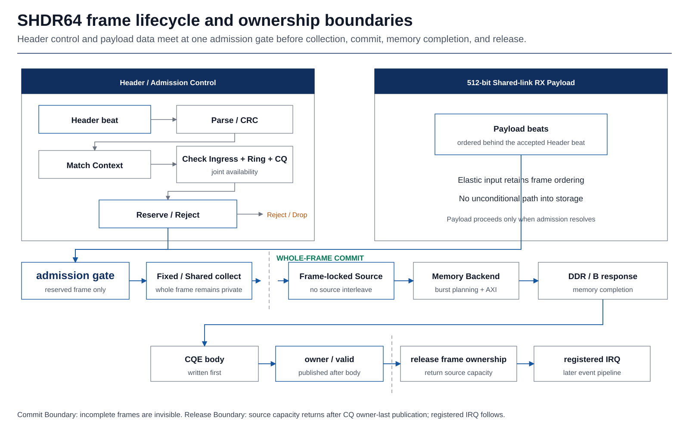
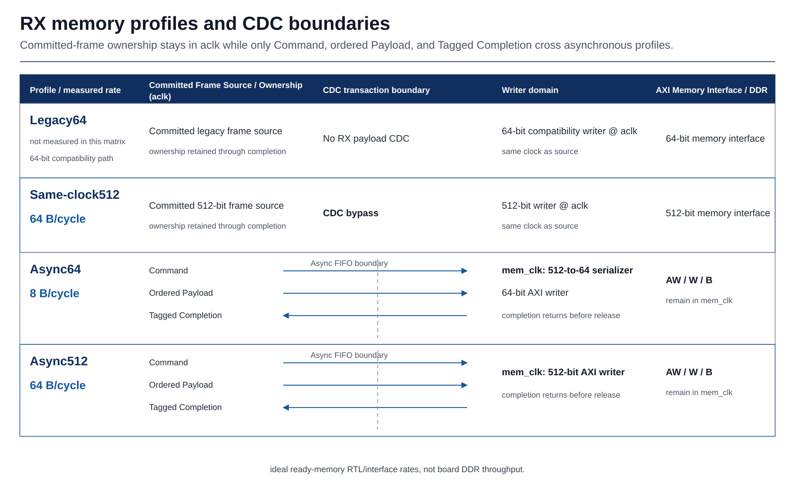

# SLVC DMA

[](https://github.com/ichigo-6301/slvc-dma-open/actions/workflows/public-integrity.yml)  [](LICENSE)

[中文](README.md) · [Architecture](docs/en/architecture.md) · [RTL Guide](docs/en/rtl_reading_guide.md) · [Verification](docs/en/verification.md) · [Results](docs/en/results.md) · [Research](docs/en/research_branches.md) · [Limitations](docs/en/limitations.md)

**A 512-bit multi-channel DMA for shared high-speed links, covering SHDR64 RX demultiplexing, descriptor-driven TX replay, AXI4-Lite control, AXI4 DDR movement, and CQ/IRQ hardware-software handoff.**

Sensors, baseband pipelines, or local endpoints can first be multiplexed into one SHDR64 segment stream. SLVC DMA selects a channel and DDR ring from header metadata, manages either fixed channel storage or a shared frame pool, and publishes software-visible completion events through a Completion Queue.

<p align="center">
  <a href="docs/assets/slvc_dma_overview.svg">
    
  </a>
</p>

<a id="key-results-and-evidence"></a>

## 60-Second Overview

<!-- claim:slvc_dma_channel_admission_isolation_directed maturity:verified -->
<!-- claim:slvc_dma_writer_reservation_component_paired_dc maturity:verified -->
<!-- claim:slvc_dma_c2b4_writer_subsystem_paired_dc maturity:verified -->
<!-- claim:slvc_dma_rx_payload_cdc_ideal_throughput maturity:verified -->
<!-- claim:slvc_dma_c2b4_n45_register_postroute_450 maturity:verified -->

| Contribution | Quantified result | Profile / boundary | Direct evidence |
| --- | --- | --- | --- |
| Multi-flow admission and buffer lifecycle | Up to 16 `flow_id` contexts; joint ingress, DDR Ring, and CQ reservation; Fixed/Shared whole-frame commit/release; CQ body-first and owner-last publication | Sixteen flows are an architecture capability. Public verification is one bounded directed case where channel 1 progresses and publishes a CQE while channel 0 is full | [Architecture](docs/en/architecture.md#virtual-channel-lifecycle) · [Verification](docs/en/verification.md#channel-admission-isolation-scenario) · [Results](docs/en/results.md#rtl-function-and-interface-throughput) · [Evidence](evidence/slvc_dma_udp_adapter_regression_summary.yaml) |
| 512-bit Writer and PPA | 4 KiB splitting, 16-beat bursts, four outstanding, independent AW/W/B progress; reservation `32 -> 7 bit`; Writer-only total/combinational area `-7.97% / -15.84%` | Same-library, same-constraint 1.5 ns Nangate45 component DC OOC A/B; not a C2B4 or complete-DMA result | [Backend](docs/en/rx_payload_512_backend.md) · [Verification](docs/en/verification.md#asic-paired-dc-evidence-contract) · [Results](docs/en/results.md#asic-paired-dc-comparisons) · [CSV](evidence/asic_paired_dc/comparisons.csv) · [Manifest](evidence/asic_paired_dc/manifest.yaml) |
| RX Memory Profiles / CDC | Same-clock512, Async64, and Async512; Command, ordered 512-bit Payload, and Tagged Completion crossing; the 512-bit profiles sustain `64 B/cycle`, `100%` W utilization, and four peak outstanding | Ready ideal-memory RTL/interface result; Async64 is `8 B/cycle`; not measured board DDR or 10G throughput | [Architecture](docs/en/architecture.md#rx-memory-development-profiles) · [Verification](docs/en/verification.md#rx-writer-and-cdc) · [Results](docs/en/results.md#rtl-function-and-interface-throughput) · [Evidence](evidence/slvc_dma_rx_payload_cdc_regression_summary.yaml) |
| C2B4 ASIC implementation | Two channels, 4 KiB/channel, register-expanded; 550 MHz DC handoff and 450 MHz route/OpenRCX/PT; setup/hold WNS `+0.041322/+0.000341 ns`; standard-cell area `1.04207 mm²`; DRC/antenna/electrical `0` | Fixed two-channel RX512 memory-subsystem implementation point; not complete DMA, SRAM, Fmax, or foundry signoff | [Architecture](docs/en/architecture.md#asic-memory-binding) · [ASIC](docs/en/asic_implementation.md#c2b4-register-expanded-profile) · [Results](docs/en/results.md#asic-c2b4-register-expanded) · [Evidence](evidence/slvc_dma_c2b4_n45_register_postroute_summary.yaml) |

<a id="frame-lifecycle"></a>

## Architecture And Frame Lifecycle

RX parses `flow_id` and length from the 64-byte SHDR64 header and admits a frame only when ingress, target DDR Ring, and CQ credits can all be reserved. Payload enters either per-channel Fixed ingress or the block-free-list-managed Shared Frame Pool. Only a whole-frame commit makes it visible to the source selector, which remains locked through frame end. After AXI responses complete, hardware writes the CQE body, publishes owner/valid and IRQ, and finally releases frame ownership.

<p align="center">
  <a href="docs/assets/slvc_dma_frame_lifecycle.svg">
    
  </a>
</p>

<p align="center">
  <a href="docs/assets/slvc_dma_virtual_channel_buffering.svg">
    
  </a>
</p>

[Read the complete data path, resource boundaries, and blocking conditions](docs/en/architecture.md)

<a id="memory-profiles-and-cdc"></a>

## AXI4 Memory Backend And CDC

Legacy64 and Same-clock512 issue AXI writes in `aclk`. Async64/Async512 cross only command, ordered 512-bit payload, and tagged completion transactions. AW/W/B remain entirely in `mem_clk`; Async64 serializes to 64 bits only inside that domain, and source-frame ownership is retained until completion returns. The design does not cross the five AXI channels independently.

<!-- claim:slvc_dma_rx_payload_cdc_regression maturity:verified -->

Same-clock512 and Async512 sustain `64 B/cycle` under the ready-memory model, while Async64 sustains `8 B/cycle`. These are RTL/interface rates, not board DDR throughput.

<p align="center">
  <a href="docs/assets/slvc_dma_memory_profiles.svg">
    
  </a>
</p>

[Read the 512-bit Writer](docs/en/rx_payload_512_backend.md) · [Read the CDC Backends](docs/en/rx_payload_cdc_backends.md)

<a id="throughput-ppa-and-asic"></a>

## Throughput, Writer PPA, And ASIC Implementation

Verified quantitative results are separated into three non-transferable scopes: Writer-only paired DC measures a local accounting structure; the ideal-memory workload measures interface delivery; C2B4 records fixed DC handoff and route/PT points for a two-channel RX512 subsystem. They do not combine into a claim that the complete DMA achieved every result.

<p align="center">
  <a href="docs/assets/slvc_dma_ppa_implementation.svg">
    
  </a>
</p>

[Read the complete result tables and calculation boundaries](docs/en/results.md)

<a id="fixed-implementation-points"></a>

## Fixed Implementation Points

<!-- claim:slvc_dma_udp_adapter_core_fpga_ooc_200m maturity:verified -->
<!-- claim:slvc_dma_udp_adapter_core_fpga_ooc_resources maturity:verified -->
<!-- claim:slvc_dma_rx_payload_cdc_fpga_ooc_200m maturity:verified -->
<!-- claim:slvc_dma_async64_vivado_2022_2_ooc_200m maturity:verified -->
<!-- claim:slvc_dma_sram_a5_clock_delivery_canary maturity:verified -->
<!-- claim:slvc_dma_sram_a5_256_area_reduction maturity:verified -->

| Fixed profile | Verified fixed point | Evidence | Boundary |
| --- | --- | --- | --- |
| Frozen Core FPGA OOC | `frame_dma_wrapper` completed Vivado 2018.3 routed OOC at 200 MHz on XC7Z100 | [FPGA summary](evidence/slvc_dma_v1_ooc_200m_summary.yaml) | Excludes the UDP adapter; not a bitstream, board timing, or throughput result |
| RX Memory development OOC | Same-clock512, Async64, and Async512 completed Vivado 2018.3 routed OOC at 200 MHz; Async64 also has a separate Vivado 2022.2 point | [Profile summary](evidence/slvc_dma_rx_payload_cdc_fpga_ooc_summary.yaml) · [Async64 summary](evidence/slvc_dma_async64_vivado_2022_2_ooc_summary.yaml) | Development OOC; not complete DMA or a board implementation |
| C2B4 register-expanded ASIC | 550 MHz DC handoff and 450 MHz OpenROAD/OpenRCX/PT internal closure | [C2B4 summary](evidence/slvc_dma_c2b4_n45_register_postroute_summary.yaml) | Two-channel RX512 subsystem; not Fmax, MMMC/OCV, or signoff |
| SRAM A5 research | One-macro clock-delivery canary verified; full C4B4 remains blocked by proxy minimum-pulse checks | [A5 summary](evidence/slvc_dma_sram_a5_development_summary.yaml) | `partial/blocked`; no C4B4 SRAM DC/P&R/PT result |

<a id="research-branches"></a>

## Experimental Research Entry

**ASIC Storage-Bank Clock Gating** is a branch-only Mapped-DC study on the two-channel C2B4 register-expanded RX512 subsystem. It is not a production profile, P&R/CTS result, post-route power result, or formal main claim. Production RTL is unchanged.

[Research branch notes](docs/en/research_branches.md) · [Canonical branch](https://github.com/ichigo-6301/slvc-dma-open/tree/research/dma-a3-clock-gating-storage-positive-2026-08)

<a id="result-scope-levels"></a>

<details>
<summary><strong>Result Scope Levels And Nonclaims</strong></summary>

| Level | Covered result | Prohibited extrapolation |
| --- | --- | --- |
| Writer-only OOC | Standalone `dma_axi_write_engine_512` at the 1.5 ns paired-DC point | Not a C2B4 or complete-DMA area reduction |
| C2B4 RX512 subsystem | Two channels, 4 KiB/channel, 64 Shared Pool blocks, register-expanded fixed point | Not complete DMA, C4B4, SRAM, or Fmax |
| Complete SLVC DMA | Sixteen-channel architecture and bounded directed regression | No complete-DMA ASIC PPA, P&R, or signoff claim |
| FPGA Async64 OOC | 200 MHz routed OOC development profile on XC7Z100 | Not a bitstream, board DDR/10G, or ASIC result |

The C2B4 Writer paired A/B did not meet subsystem promotion conditions: W0 already closed the fixed 550 MHz point. The full negative result remains in the [results document](docs/en/results.md#asic-paired-dc-comparisons). Writer-bounded SpyGlass has zero fatal and zero error; the full C2B4 common scope is not declared clean. See the [verification contract](docs/en/verification.md#asic-paired-dc-evidence-contract).

</details>

<a id="quick-public-checks"></a>

<details>
<summary><strong>Quick Public Checks</strong></summary>

These commands do not run ModelSim/Questa, Vivado, DC, OpenROAD, or PrimeTime:

```bash
make showcase-assets-check
make showcase-check
make slvc_dma_512_defconfig
make sim-dry-run
make asic-evidence-check
```

`asic-evidence-check` validates sanitized Evidence, hashes, and identity contracts only. It does not rerun commercial EDA or physical implementation. With ModelSim/Questa installed, the default, RX-wide, Async64, and Async512 regressions are available through `make <profile>_defconfig sim`.

</details>

<a id="ten-minute-rtl-reading-path"></a>

<details>
<summary><strong>10-Minute RTL Reading Path</strong></summary>

| Order | File and reading focus |
| ---: | --- |
| 1 | [`slvc_dma_wrapper.v`](rtl/integration/slvc_dma_wrapper.v): 512-bit streams, AXI-Lite, memory master, control-message, and clock/reset boundaries. |
| 2 | [`dma_rx_parser_pipe.v`](rtl/rx/dma_rx_parser_pipe.v) · [`dma_rx_channel_match.v`](rtl/rx/dma_rx_channel_match.v) · [`dma_rx_channel_table.v`](rtl/rx/dma_rx_channel_table.v): SHDR64 metadata, `flow_id` matching, and channel contexts. |
| 3 | [`frame_dma_rx_top.v`](rtl/integration/frame_dma_rx_top.v): ring/free-space, buffer/CQ credits, reservation, and commit. |
| 4 | [`dma_rx_ingress_queue.v`](rtl/rx/dma_rx_ingress_queue.v) · [`dma_rx_frame_shared_adapter.v`](rtl/rx/dma_rx_frame_shared_adapter.v) · [`dma_frame_shared_pool.v`](rtl/rx/dma_frame_shared_pool.v): Fixed/Shared storage, block free list, and whole-frame commit/release. |
| 5 | [`dma_rx_ingress_source_selector.v`](rtl/rx/dma_rx_ingress_source_selector.v): Fixed/Shared selection and frame locking. |
| 6 | [`dma_axi_write_engine_512.v`](rtl/rx/dma_axi_write_engine_512.v): 4 KiB splitting, burst planning, AW/W/B, outstanding traffic, and reservation credit. |
| 7 | [`dma_rx_payload_cdc_bridge.v`](rtl/rx/dma_rx_payload_cdc_bridge.v) · [`dma_async_fifo.v`](rtl/common/dma_async_fifo.v): command/payload/completion transactions and Gray-pointer CDC. |
| 8 | [`tb_rtl_v33e20a107_udp_to_dma_smoke.v`](pattern/tb_rtl_v33e20a107_udp_to_dma_smoke.v) · [`tb_rtl_rx_payload_writer_512.v`](pattern/tb_rtl_rx_payload_writer_512.v): the admission/CQE scenario and 2,028 Writer cases. |

[Open the complete RTL Reading Guide](docs/en/rtl_reading_guide.md#ten-minute-review-path)

</details>

## Choose An Integration Entrypoint

| Goal | Canonical top / boundary | Configuration and check |
| --- | --- | --- |
| Complete 512-bit Shared-Link DMA | [`slvc_dma_wrapper`](rtl/integration/slvc_dma_wrapper.v) | [`slvc_dma_512.f`](flows/manifests/slvc_dma_512.f) · `make sim-dry-run` |
| FPGA OOC timing top | [`frame_dma_wrapper`](rtl/integration/frame_dma_wrapper.v) | `make fpga-ooc-dry-run` |
| Fixed Ethernet/IPv4/UDP RX adaptation | [`dma_udp_ipv4_to_shdr64_adapter`](rtl/adapters/dma_udp_ipv4_to_shdr64_adapter.v) -> `slvc_dma_wrapper` | Default defconfig · [protocol boundary](docs/en/udp_ipv4_adapter.md) |
| Same-clock or dual-clock RX memory backend | [`frame_dma_rx_top`](rtl/integration/frame_dma_rx_top.v) | `slvc_dma_512_rx_{wide,async64,async512}_defconfig` |

[Read the port, clock/reset, bring-up, and ownership contracts](docs/en/integration.md)

## Documentation And Release Boundary

[Interfaces](docs/en/interfaces.md) · [RTL Reading Guide](docs/en/rtl_reading_guide.md) · [Verification Matrix](docs/en/verification_matrix.md) · [Dual-Clock Backends](docs/en/rx_payload_cdc_backends.md) · [FPGA Implementation](docs/en/fpga_implementation.md) · [ASIC Implementation](docs/en/asic_implementation.md) · [Delivery Status](docs/en/delivery_status.md) · [Research Branches](docs/en/research_branches.md) · [Evidence](provenance/evidence.yaml) · [Claims](provenance/claims.yaml)

Current `main` is the showcase and development line after `v0.1.0-rc1`. The immutable annotated `v0.1.0-rc1` tag continues to bind its original release source, Evidence, and checksum manifest. Complete nonclaims are in [Limitations](docs/en/limitations.md) and [Public Scope](PUBLIC_SCOPE.md).
