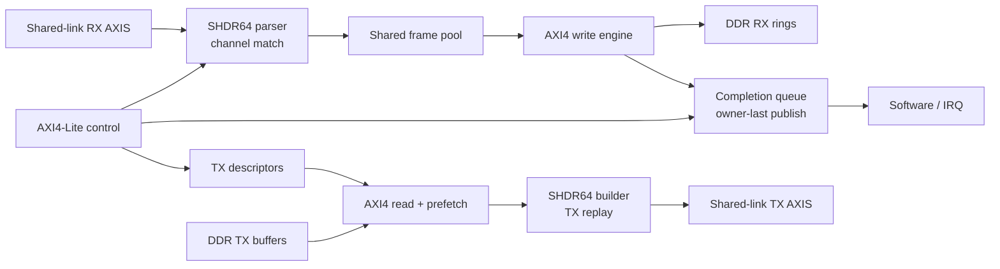

# SLVC DMA

[](https://github.com/ichigo-6301/slvc-dma-open/actions/workflows/public-integrity.yml)

[English](README.en.md)

源码阅读入口： [中文 RTL 阅读指南](docs/zh-CN/rtl_reading_guide.md)。本次注释同步只
增加普通中文注释和阅读文档，不改变 RTL 功能 token、接口、QoR 或冻结 tag。

SLVC DMA 是面向共享高速链路的 512-bit 虚拟通道 DMA IP。多个上游源可先复用为带
SHDR64 header 的共享 segment stream；DMA 根据 channel metadata 在共享链路与 DDR
ring 之间搬运 payload，并通过 completion queue 向软件发布完成事件。

## 当前公开版本

`v0.1.0-rc1` 发布 `slvc_dma_wrapper`、`frame_dma_wrapper`、可选 carrier adapter
和 MCF companion。该版本冻结 512-bit Aurora-compatible profile，以及对应的
ModelSim/Questa regression 和 Vivado 2018.3 OOC 实现入口。

`v0.1.0-rc1` 是 frozen tag。`main` 可以包含 documentation、delivery 和 public
integrity update；这些 update 不会改变 frozen tag target。详情见
[Release Notes](docs/zh-CN/release_notes.md)。

本 delivery 分支还暂存一个**可选 P0 Ethernet II / IPv4 / UDP RX adapter**。它将
固定 512-bit packet AXI4-Stream profile 转换为 SHDR64，不修改 frozen DMA core、
register map、CQE ABI 或 RC1 tag。精确协议边界与 nonclaim 见
[UDP/IPv4 Adapter](docs/zh-CN/udp_ipv4_adapter.md)。

原生路径为 `Aurora/原生 SHDR64 -> SLVC DMA`；可选兼容路径为
`Ethernet II / IPv4 / UDP -> UDP-to-SHDR64 Adapter -> SLVC DMA`。Adapter 由
`CONFIG_SLVC_DMA_UDP_IPV4_ADAPTER` 控制，不是完整 Ethernet stack，也不提供
UDP 端到端流控。默认 defconfig 启用 Adapter，因此仿真要求 10 个 frozen-core
marker 加 4 个 adapter marker，共 14 个；使用
`configs/slvc_dma_512_core_only_defconfig` 时只要求 10 个 core marker。

## Stage 状态

| Stage | 状态 | 公开边界 |
| --- | --- | --- |
| Directed RTL regression | [verified](docs/zh-CN/verification_matrix.md) | Windows ModelSim 与 IC_EDA Questa 均完成 release-bound 十项测试。 |
| Optional adapter regression | [verified](docs/zh-CN/verification_matrix.md) | 四项 adapter test 在两个 simulator host 均通过。 |
| FPGA OOC implementation | [verified](docs/zh-CN/results.md) | Vivado 2018.3 三种 strategy 完成 200 MHz OOC setup/hold。 |
| Adapter ASIC frontend | [verified](docs/zh-CN/udp_ipv4_adapter.md) | adapter-only DC OOC 达到 5.000 ns；不声明 physical/signoff。 |
| Carrier CDC | [partial](docs/zh-CN/delivery_status.md) | directed behavior 已验证，尚无完整 CDC/RDC signoff。 |
| Full DMA ASIC frontend | [planned](docs/zh-CN/delivery_status.md) | 需要单独 library-bound profile 与 evidence。 |
| Physical implementation | [blocked](docs/zh-CN/delivery_status.md) | 等待 validated standard-cell 和 SRAM macro physical view。 |
| Board validation | [not claimed](docs/zh-CN/delivery_status.md) | 精确 public release commit 不声明板级结果。 |
| Lossless 10G operation | [not claimed](docs/zh-CN/delivery_status.md) | 本 release 不是 board-level 10G production validation。 |

## 功能特性

- 512-bit shared-link AXI-Stream RX/TX 数据路径和 64-byte SHDR64 framing；
- RX header parsing、channel match/admission、共享 frame pool 和 DDR ring write；
- descriptor-driven TX payload read、prefetch、SHDR64 重建和 shared-link replay；
- AXI4-Lite channel、descriptor、ring pointer、CQ、状态和 IRQ 控制；
- CQ body-first、owner/valid-last 发布，避免软件读取部分完成记录；
- AXI/AXI-Stream backpressure、payload writer prefetch 和本地 soft-reset 控制；
- 可选 carrier CDC adapter，以及用于多源汇聚的 MCF companion endpoint。
- 可选同频 512、双时钟 64 和双时钟 512 RX memory backend。
- 可选固定 profile 的 512-bit Ethernet II / IPv4 / UDP RX-to-SHDR64 adapter。

## 系统架构



`slvc_dma_wrapper` 是面向系统集成的公开顶层。`frame_dma_wrapper` 是本次
FPGA OOC 的完整 timing top。carrier adapter 和 MCF endpoint 位于 DMA 边界之外，
不改变 DDR/CQ ownership 语义。

`dma_udp_ipv4_to_shdr64_adapter` 可放在 shared-link RX 输入之前。它将 UDP
destination port 映射为 `SHDR64.flow_id`，并继续由未修改的 DMA channel table
完成 channel 与 DDR context 选择。

## Release Profile

| 项目 | `slvc_dma_v1_512` |
| --- | --- |
| Shared-link data width | 512 bit |
| Keep width | 64 bit |
| SHDR64 size | 64 byte |
| Maximum payload | 4096 byte |
| FPGA timing target | 200 MHz / 5.000 ns |
| FPGA device | `xc7z100ffg900-2` |
| OOC top | `frame_dma_wrapper` |

控制寄存器、descriptor、CQE 和 ownership 规则见
[接口文档](docs/zh-CN/interfaces.md)；公开 RTL port list 是最终接口定义。

### 可选 RX Memory 开发 Profile

三条默认关闭的 profile 共用 committed-frame source 和独立 RX AXI4 边界：同频
512、双时钟 64 和双时钟 512。异步 profile 只跨一个 command、有序 512-bit
payload entry 和一个 tagged completion；AW/W/B 全部位于 `mem_clk`。冻结 wrapper、
legacy 64-bit path、SHDR64/admission、CQ、TX 与 descriptor 均保持不变。

同频 profile 的综合网表没有 RX payload CDC cell。两个异步 profile 均通过 13 条
command、14 个 marker 的 ModelSim/Questa regression、两个时钟的 200 MHz routed OOC，以及 5 ns Design
Compiler OOC。这些是开发分支 evidence，不进入冻结 RC1 evidence set。详见
[同频后端指南](docs/zh-CN/rx_payload_512_backend.md)和
[双时钟后端指南](docs/zh-CN/rx_payload_cdc_backends.md)。

## 已核验结果

| Vivado 2018.3 strategy | WNS | WHS | LUT | FF | RAMB36 | RAMB18 | DSP |
| --- | ---: | ---: | ---: | ---: | ---: | ---: | ---: |
| Explore | +0.226 ns | +0.045 ns | 38,074 | 40,787 | 44 | 3 | 0 |
| Performance_Explore | +0.173 ns | +0.046 ns | 38,087 | 40,787 | 44 | 3 | 0 |
| ExtraNetDelay_high | +0.162 ns | +0.054 ns | 38,088 | 40,785 | 44 | 3 | 0 |

三组 routed OOC 实现的 TNS/THS 均为 0。选定 10 项 directed regression 已在
Windows ModelSim SE-64 2020.4 和 IC_EDA Linux Questa Sim-64 10.7c 通过。writer
prefetch smoke 在指定 long multi-burst case 中观测到 48 个连续 512-bit AXI W
beat；该结果不是端到端 10G lossless throughput 声明。

可选 adapter 在两个 simulator host 上新增四项测试：18 个 directed boundary/parser
case（覆盖 4096-byte 上限）、400 个 deterministic-random packet、23-case
error/reset/stall matrix（17 个显式非法包 Drop、23 个成功 Accept），以及 two-channel adapter-to-DMA smoke。独立 Design
Compiler OOC 在 5.000 ns 下得到
+0.39 ns WNS、0 TNS；adapter-only mapped area 为 11744.32 library area unit。
该结果不包含 DMA core，也不是 physical design 或 ASIC signoff evidence。

完整条件、source commit、checksum 和 caveat 见
[结果](docs/zh-CN/results.md)、[验证](docs/zh-CN/verification.md) 与
[`provenance/`](provenance/)。

## 快速开始

### 1. 配置与公开完整性检查

```text
python3 flows/scripts/flowctl.py defconfig --source configs/slvc_dma_512_defconfig
python3 flows/scripts/flowctl.py show-config
python3 flows/scripts/public_hygiene.py --root .
```

### 2. Simulator regression

```text
python3 flows/scripts/flowctl.py sim-dry-run
python3 flows/scripts/flowctl.py sim
```

关闭可选 Adapter 时使用：

```text
python3 flows/scripts/flowctl.py defconfig --source configs/slvc_dma_512_core_only_defconfig
python3 flows/scripts/flowctl.py show-config
python3 flows/scripts/flowctl.py sim-dry-run
```

### 3. Vivado OOC entrypoint

```text
python3 flows/scripts/flowctl.py fpga-ooc-dry-run
```

### 4. 可选 Adapter-Only DC OOC entrypoint

```text
python3 flows/scripts/flowctl.py adapter-dc-ooc-dry-run
```

### 5. 可选 RX Memory Profile

```text
python3 flows/scripts/flowctl.py defconfig --source configs/slvc_dma_512_rx_wide_defconfig
python3 flows/scripts/flowctl.py show-config
python3 flows/scripts/flowctl.py sim-dry-run
python3 flows/scripts/flowctl.py fpga-ooc-dry-run
python3 flows/scripts/flowctl.py rx-payload-writer-dc-ooc-dry-run
```

选择双时钟 profile 时，将 defconfig 替换为以下之一：

```text
configs/slvc_dma_512_rx_async64_defconfig
configs/slvc_dma_512_rx_async512_defconfig
```

公开 runner 要求 Python 3.6 或更高版本。`sim` 需要 ModelSim/Questa；
`fpga-ooc` 需要 Vivado 2018.3；两个 DC OOC command 都需要 Design Compiler 和未跟踪的
本地 standard-cell `.db`。GNU Make target 是便利封装；Windows 若只有
`python.exe`，可将 `python3` 替换为 `python`。工具路径与本地环境变量仅放在
ignored `flows/local/`。完整流程见 [Flow README](flows/README.md)。

## 顶层与目录

| 路径 | 内容 |
| --- | --- |
| `rtl/include/` | 协议、寄存器和 profile 共享定义 |
| `rtl/common/` | AXI-Stream register/FIFO、CDC FIFO、宽度聚合与 RAM 原语 |
| `rtl/rx/`, `rtl/tx/` | RX admission/write 与 descriptor-driven TX replay |
| `rtl/cq/`, `rtl/control/` | Completion Queue 发布与 AXI4-Lite/UFC 控制面 |
| `rtl/integration/` | Core 集成、系统 wrapper 和 FPGA OOC top |
| `rtl/carrier/`, `rtl/adapters/` | Carrier/CDC/MCF/Aurora 边界与可选 packet adapter |
| `rtl/integration/slvc_dma_wrapper.v` | 系统集成顶层 |
| `rtl/integration/frame_dma_wrapper.v` | 200 MHz OOC timing top |
| `rtl/adapters/dma_udp_ipv4_to_shdr64_adapter.v` | 可选固定 profile Ethernet/IPv4/UDP RX adapter |
| `pattern/`, `modelsim/` | 公开 directed testbench 与运行脚本 |
| `asic/dc/` | Adapter-only 与 RX-writer-only Design Compiler OOC 入口；不分发工艺库 |
| `fpga/xilinx/` | Vivado 2018.3 OOC Tcl 入口 |
| `flows/`, `configs/` | 可移植 runner、manifest 和 defconfig |
| `evidence/`, `provenance/` | 固定提交的验证、PPA 与 SHA-256 证据 |

## 文档导航

- [架构](docs/zh-CN/architecture.md)
- [接口](docs/zh-CN/interfaces.md)
- [集成指南](docs/zh-CN/integration.md)
- [UDP/IPv4 Adapter](docs/zh-CN/udp_ipv4_adapter.md)
- [可选 512-bit RX Payload 后端](docs/zh-CN/rx_payload_512_backend.md)
- [可选双时钟 RX Payload 后端](docs/zh-CN/rx_payload_cdc_backends.md)
- [模块目录](docs/zh-CN/module_catalog.md)
- [验证](docs/zh-CN/verification.md)
- [验证矩阵](docs/zh-CN/verification_matrix.md)
- [已核验结果](docs/zh-CN/results.md)
- [FPGA 实现](docs/zh-CN/fpga_implementation.md)
- [Delivery 状态](docs/zh-CN/delivery_status.md)
- [Release Notes](docs/zh-CN/release_notes.md)
- [限制](docs/zh-CN/limitations.md)
- [路线图](docs/zh-CN/roadmap.md)
- [公开范围](PUBLIC_SCOPE.md)
- [Fresh-clone 验证](FRESH_CLONE_VALIDATION.md)
- [贡献](CONTRIBUTING.md)、[支持边界](SUPPORT.md)、[安全报告](SECURITY.md)

## 当前限制

- 仅冻结 512-bit profile；通用 128-bit profile 尚未实现；
- 200 MHz 数值是 OOC 结果，不是 board implementation 或 10G lossless claim；
- directed regression 不等价于 coverage、formal 或 CDC/RDC signoff；
- 当前公开版本不包含 P0/U5 board design、generated Xilinx IP、SDK application、
  ASIC SRAM/library、DFT、P&R 或 signoff STA。
- 可选 adapter 不是完整 Ethernet/IP stack，不声明 board-level 或 lossless UDP。
- 可选 RX memory profile 仅支持同频 512、async64 和 async512；不声明任意位宽、
  单边 hard-reset recovery、板级 DDR throughput、完整 DMA ASIC 实现或 signoff。

详细边界以 [限制文档](docs/zh-CN/limitations.md) 和
[公开范围](PUBLIC_SCOPE.md) 为准。
