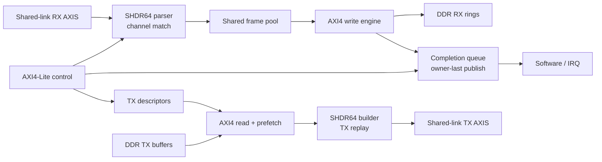

# SLVC DMA

[English](README.en.md)

SLVC DMA 是面向共享高速链路的 512-bit 虚拟通道 DMA IP。多个上游源可先复用为带
SHDR64 header 的共享 segment stream；DMA 根据 channel metadata 在共享链路与 DDR
ring 之间搬运 payload，并通过 completion queue 向软件发布完成事件。

## 当前公开版本

`v0.1.0-rc1` 发布 `slvc_dma_wrapper`、`frame_dma_wrapper`、可选 carrier adapter
和 MCF companion。该版本冻结 512-bit Aurora-compatible profile，以及对应的
ModelSim/Questa regression 和 Vivado 2018.3 OOC 实现入口。

## 功能特性

- 512-bit shared-link AXI-Stream RX/TX 数据路径和 64-byte SHDR64 framing；
- RX header parsing、channel match/admission、共享 frame pool 和 DDR ring write；
- descriptor-driven TX payload read、prefetch、SHDR64 重建和 shared-link replay；
- AXI4-Lite channel、descriptor、ring pointer、CQ、状态和 IRQ 控制；
- CQ body-first、owner/valid-last 发布，避免软件读取部分完成记录；
- AXI/AXI-Stream backpressure、payload writer prefetch 和本地 soft-reset 控制；
- 可选 carrier CDC adapter，以及用于多源汇聚的 MCF companion endpoint。

## 系统架构



`slvc_dma_wrapper` 是面向系统集成的公开顶层。`frame_dma_wrapper` 是本次
FPGA OOC 的完整 timing top。carrier adapter 和 MCF endpoint 位于 DMA 边界之外，
不改变 DDR/CQ ownership 语义。

## Release Profile

| 项目 | `slvc_dma_v1_512` |
| --- | --- |
| Shared-link data width | 512 bit |
| Keep width | 64 bit |
| SHDR64 size | 64 byte |
| Maximum payload | 4096 byte |
| FPGA timing target | 200 MHz / 5.000 ns |
| FPGA device | `xc7z100ffg900-2` |
| OOC top | `frame_dma_wrapper` |

控制寄存器、descriptor、CQE 和 ownership 规则见
[接口文档](docs/zh-CN/interfaces.md)；公开 RTL port list 是最终接口定义。

## 已核验结果

| Vivado 2018.3 strategy | WNS | WHS | LUT | FF | RAMB36 | RAMB18 | DSP |
| --- | ---: | ---: | ---: | ---: | ---: | ---: | ---: |
| Explore | +0.226 ns | +0.045 ns | 38,074 | 40,787 | 44 | 3 | 0 |
| Performance_Explore | +0.173 ns | +0.046 ns | 38,087 | 40,787 | 44 | 3 | 0 |
| ExtraNetDelay_high | +0.162 ns | +0.054 ns | 38,088 | 40,785 | 44 | 3 | 0 |

三组 routed OOC 实现的 TNS/THS 均为 0。选定 10 项 directed regression 已在
Windows ModelSim SE-64 2020.4 和 IC_EDA Linux Questa Sim-64 10.7c 通过。writer
prefetch smoke 在指定 long multi-burst case 中观测到 48 个连续 512-bit AXI W
beat；该结果不是端到端 10G lossless throughput 声明。

完整条件、source commit、checksum 和 caveat 见
[结果](docs/zh-CN/results.md)、[验证](docs/zh-CN/verification.md) 与
[`provenance/`](provenance/)。

## 快速开始

```text
python3 flows/scripts/flowctl.py defconfig --source configs/slvc_dma_512_defconfig
python3 flows/scripts/flowctl.py show-config
python3 flows/scripts/flowctl.py sim-dry-run
python3 flows/scripts/flowctl.py sim
python3 flows/scripts/flowctl.py fpga-ooc-dry-run
```

公开 runner 要求 Python 3.6 或更高版本。`sim` 需要 ModelSim/Questa；
`fpga-ooc` 需要 Vivado 2018.3。GNU Make target 是便利封装；Windows 若只有
`python.exe`，可将 `python3` 替换为 `python`。工具路径与本地环境变量仅放在
ignored `flows/local/`。完整流程见 [Flow README](flows/README.md)。

## 顶层与目录

| 路径 | 内容 |
| --- | --- |
| `rtl/` | DMA、carrier adapter 和 MCF companion RTL |
| `rtl/slvc_dma_wrapper.v` | 系统集成顶层 |
| `rtl/frame_dma_wrapper.v` | 200 MHz OOC timing top |
| `pattern/`, `modelsim/` | 公开 directed testbench 与运行脚本 |
| `fpga/xilinx/` | Vivado 2018.3 OOC Tcl 入口 |
| `flows/`, `configs/` | 可移植 runner、manifest 和 defconfig |
| `evidence/`, `provenance/` | 固定提交的验证、PPA 与 SHA-256 证据 |

## 文档导航

- [架构](docs/zh-CN/architecture.md)
- [接口](docs/zh-CN/interfaces.md)
- [验证](docs/zh-CN/verification.md)
- [已核验结果](docs/zh-CN/results.md)
- [FPGA 实现](docs/zh-CN/fpga_implementation.md)
- [限制](docs/zh-CN/limitations.md)
- [路线图](docs/zh-CN/roadmap.md)
- [公开范围](PUBLIC_SCOPE.md)
- [Fresh-clone 验证](FRESH_CLONE_VALIDATION.md)

## 当前限制

- 仅冻结 512-bit profile；通用 128-bit profile 尚未实现；
- 200 MHz 数值是 OOC 结果，不是 board implementation 或 10G lossless claim；
- directed regression 不等价于 coverage、formal 或 CDC/RDC signoff；
- 当前公开版本不包含 P0/U5 board design、generated Xilinx IP、SDK application、
  ASIC SRAM/library、DFT、P&R 或 signoff STA。

详细边界以 [限制文档](docs/zh-CN/limitations.md) 和
[公开范围](PUBLIC_SCOPE.md) 为准。
