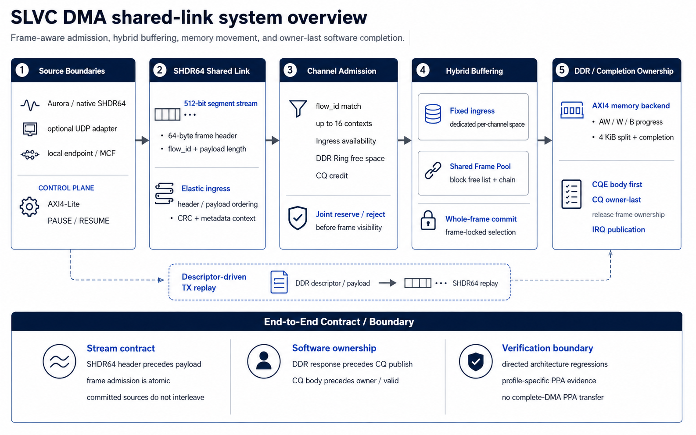
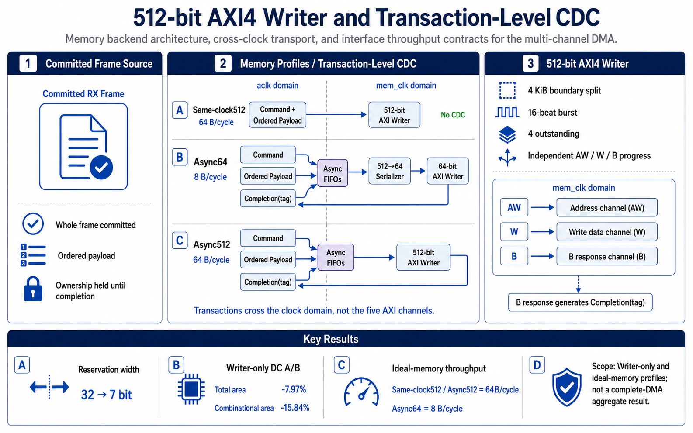
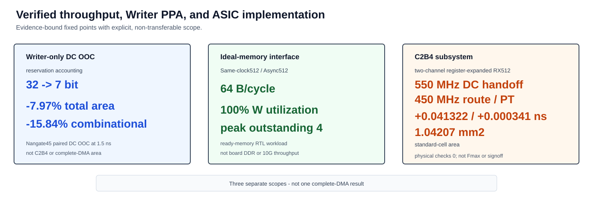

# SLVC DMA

[](https://github.com/ichigo-6301/slvc-dma-open/actions/workflows/public-integrity.yml)  [](LICENSE)

[English](README.en.md) · [架构](docs/zh-CN/architecture.md) · [RTL 导读](docs/zh-CN/rtl_reading_guide.md) · [验证](docs/zh-CN/verification.md) · [结果](docs/zh-CN/results.md) · [研究快照](docs/zh-CN/research_branches.md) · [限制](docs/zh-CN/limitations.md)

**面向多源共享高速链路的 512-bit 多通道 DMA，覆盖 SHDR64 RX 分流、Descriptor TX 回放、AXI4-Lite 控制、AXI4 DDR 搬运及 CQ/IRQ 软硬件交接。**

多个传感器、基带处理单元或本地 endpoint 可以先复用为一条 SHDR64 segment stream。SLVC DMA 依据 header metadata 选择 channel 与 DDR ring，在固定通道缓冲和共享 frame pool 之间管理资源，并通过 Completion Queue 向软件发布完成事件。

<p align="center">
  <a href="docs/assets/showcase/slvc_dma_system_overview.png">
    
  </a>
</p>

该图把 shared-link RX、descriptor-driven TX、联合准入、混合缓存和 DDR/CQ ownership 放在同一系统边界中；正式数字仍以公开表格和 Evidence 为准。

<a id="key-results-and-evidence"></a>

## 60 秒总览

<!-- claim:slvc_dma_channel_admission_isolation_directed maturity:verified -->
<!-- claim:slvc_dma_writer_reservation_component_paired_dc maturity:verified -->
<!-- claim:slvc_dma_c2b4_writer_subsystem_paired_dc maturity:verified -->
<!-- claim:slvc_dma_rx_payload_cdc_ideal_throughput maturity:verified -->
<!-- claim:slvc_dma_c2b4_n45_register_postroute_450 maturity:verified -->

| 贡献 | 量化结果 | Profile / 边界 | 直接 Evidence |
| --- | --- | --- | --- |
| 多流准入与缓存生命周期 | 最多 16 路 `flow_id` context；联合检查并预留 ingress、DDR Ring 与 CQ；Fixed/Shared 整帧 commit/release；CQ body-first、owner-last | 16 路是架构能力；公开验证是 channel 0 满时 channel 1 继续前进并发布 CQE 的有界定向场景 | [架构](docs/zh-CN/architecture.md#虚拟通道生命周期) · [验证](docs/zh-CN/verification.md#channel-admission-隔离场景) · [结果](docs/zh-CN/results.md#rtl-功能与接口吞吐) · [Evidence](evidence/slvc_dma_udp_adapter_regression_summary.yaml) |
| 512-bit Writer 与 PPA | 4 KiB split、16-beat Burst、4 Outstanding、AW/W/B 独立推进；reservation `32 -> 7 bit`；Writer-only 总/组合面积 `-7.97% / -15.84%` | 同库同约束 1.5 ns Nangate45 DC OOC 组件 A/B；不能外推至 C2B4 或完整 DMA | [后端](docs/zh-CN/rx_payload_512_backend.md) · [验证](docs/zh-CN/verification.md#asic-paired-dc-证据合同) · [结果](docs/zh-CN/results.md#asic-paired-dc-对比) · [CSV](evidence/asic_paired_dc/comparisons.csv) · [Manifest](evidence/asic_paired_dc/manifest.yaml) |
| RX Memory Profiles / CDC | Same-clock512、Async64、Async512；跨域 Command、按序 512-bit Payload 与 Tagged Completion；512-bit profile 为 `64 B/cycle`、W utilization `100%`、peak outstanding `4` | ready ideal-memory RTL/interface 结果；Async64 为 `8 B/cycle`；不是板级 DDR 或 10G 实测 | [架构](docs/zh-CN/architecture.md#rx-memory-开发-profile) · [验证](docs/zh-CN/verification.md#rx-writer-与-cdc) · [结果](docs/zh-CN/results.md#rtl-功能与接口吞吐) · [Evidence](evidence/slvc_dma_rx_payload_cdc_regression_summary.yaml) |
| C2B4 ASIC implementation | 两通道、4 KiB/channel、register-expanded；550 MHz DC handoff，450 MHz route/OpenRCX/PT；setup/hold WNS `+0.041322/+0.000341 ns`；standard-cell area `1.04207 mm²`；DRC/antenna/electrical `0` | 固定两通道 RX512 memory-subsystem 实现点；不是完整 DMA、SRAM、Fmax 或 foundry signoff | [架构](docs/zh-CN/architecture.md#asic-memory-binding) · [ASIC](docs/zh-CN/asic_implementation.md#c2b4-register-expanded-profile) · [结果](docs/zh-CN/results.md#asic-c2b4-register-expanded) · [Evidence](evidence/slvc_dma_c2b4_n45_register_postroute_summary.yaml) |

<a id="frame-lifecycle"></a>

## 架构与帧生命周期

RX 从 64-byte SHDR64 header 解析 `flow_id` 与长度，只有 ingress、目标 DDR Ring 和 CQ credit 同时可预留时才接收整帧。Payload 进入 per-channel Fixed ingress 或 block free-list 管理的 Shared Frame Pool；整帧 commit 后，source selector 才会锁定一个 source 直到 frame end。AXI response 完成后先写 CQE body，再发布 owner/valid 与 IRQ，最后释放 frame ownership。

[详细帧生命周期图](docs/assets/slvc_dma_frame_lifecycle.svg) · [Fixed/Shared 虚拟通道图](docs/assets/slvc_dma_virtual_channel_buffering.svg) · [完整数据路径、资源边界和阻塞条件](docs/zh-CN/architecture.md)

<a id="memory-profiles-and-cdc"></a>

## AXI4 Memory Backend 与 CDC

Legacy64 和 Same-clock512 在 `aclk` 内完成 AXI 写入；Async64/Async512 只跨越 command、ordered 512-bit payload 和 tagged completion transaction。AW/W/B 始终留在 `mem_clk`，Async64 仅在该域内序列化为 64 bit；completion 返回前不会释放 source frame。它不是把 AXI 五通道分别跨域。

<!-- claim:slvc_dma_rx_payload_cdc_regression maturity:verified -->

Same-clock512 与 Async512 在 ready-memory model 下为 `64 B/cycle`，Async64 为 `8 B/cycle`。这些是 RTL/interface 速率，不是板级 DDR throughput。

<p align="center">
  <a href="docs/assets/showcase/slvc_dma_writer_transaction_cdc.png">
    
  </a>
</p>

图中的 `32 -> 7 bit` 与面积变化属于 Writer-only paired DC，不能外推为 C2B4 或完整 DMA 结果。

[详细 Memory Profile 矩阵](docs/assets/slvc_dma_memory_profiles.svg) · [查看 512-bit Writer](docs/zh-CN/rx_payload_512_backend.md) · [查看 CDC Backend](docs/zh-CN/rx_payload_cdc_backends.md)

<a id="throughput-ppa-and-asic"></a>

## 吞吐、Writer PPA 与 ASIC 实现

正式量化结果按三个互不外推的 scope 管理：Writer-only paired DC 说明局部记账结构的面积变化；ideal-memory workload 说明接口供数能力；C2B4 说明固定两通道 RX512 子系统的 DC handoff 和 route/PT 实现点。三者不组合成“完整 DMA 同时获得全部结果”的结论。

<p align="center">
  <a href="docs/assets/slvc_dma_ppa_implementation.svg">
    
  </a>
</p>

[查看完整结果表与计算边界](docs/zh-CN/results.md)

<a id="fixed-implementation-points"></a>

## 固定实现点

<!-- claim:slvc_dma_udp_adapter_core_fpga_ooc_200m maturity:verified -->
<!-- claim:slvc_dma_udp_adapter_core_fpga_ooc_resources maturity:verified -->
<!-- claim:slvc_dma_rx_payload_cdc_fpga_ooc_200m maturity:verified -->
<!-- claim:slvc_dma_async64_vivado_2022_2_ooc_200m maturity:verified -->
<!-- claim:slvc_dma_sram_a5_clock_delivery_canary maturity:verified -->
<!-- claim:slvc_dma_sram_a5_256_area_reduction maturity:verified -->

| 固定 Profile | 已验证固定点 | Evidence | 边界 |
| --- | --- | --- | --- |
| Frozen Core FPGA OOC | `frame_dma_wrapper` 在 XC7Z100 上完成 Vivado 2018.3 routed OOC 200 MHz | [FPGA summary](evidence/slvc_dma_v1_ooc_200m_summary.yaml) | 不含 UDP adapter；不是 bitstream、板级 timing 或吞吐 |
| RX Memory development OOC | Same-clock512、Async64、Async512 在 Vivado 2018.3 routed OOC 200 MHz；Async64 另有 Vivado 2022.2 固定点 | [Profile summary](evidence/slvc_dma_rx_payload_cdc_fpga_ooc_summary.yaml) · [Async64 summary](evidence/slvc_dma_async64_vivado_2022_2_ooc_summary.yaml) | Development OOC；不是完整 DMA 或板级实现 |
| C2B4 register-expanded ASIC | 550 MHz DC handoff；450 MHz OpenROAD/OpenRCX/PT internal closure | [C2B4 summary](evidence/slvc_dma_c2b4_n45_register_postroute_summary.yaml) | 两通道 RX512 subsystem；不是 Fmax、MMMC/OCV 或 signoff |
| SRAM A5 research | 单宏 clock-delivery canary 已验证；完整 C4B4 仍被 proxy minimum-pulse 检查阻塞 | [A5 summary](evidence/slvc_dma_sram_a5_development_summary.yaml) | `partial/blocked`；没有 C4B4 SRAM DC/P&R/PT 结果 |

<a id="research-branches"></a>

## 实验性研究快照

**ASIC Storage-Bank Clock Gating** 是两通道 C2B4 register-expanded RX512 子系统上的独立 Mapped-DC 研究快照。该结果已通过不可变 Archive Tag 和固定 Commit 归档，不属于生产 Profile、P&R/CTS、post-route power 或正式 main Claim；Production RTL 未修改。

[研究快照说明](docs/zh-CN/research_branches.md) · [固定研究提交](https://github.com/ichigo-6301/slvc-dma-open/tree/d99234ffb3d7d9a5b068ca4434fcfce8b7fd5c79) · [Archive Tag `archive/slvc-dma-storage-clock-gating-positive-2026-08`](https://github.com/ichigo-6301/slvc-dma-open/tree/archive/slvc-dma-storage-clock-gating-positive-2026-08)

<a id="result-scope-levels"></a>

<details>
<summary><strong>结果作用层级与 Nonclaim</strong></summary>

| 层级 | 结果覆盖范围 | 不可外推的结论 |
| --- | --- | --- |
| Writer-only OOC | 单独综合 `dma_axi_write_engine_512` 的 1.5 ns paired-DC | 不能外推为 C2B4 或完整 DMA 面积下降 |
| C2B4 RX512 subsystem | 两通道、4 KiB/channel、Shared Pool 64 blocks、register-expanded 固定实现点 | 不是完整 DMA、C4B4、SRAM 或 Fmax |
| 完整 SLVC DMA | 16-channel 架构与有界 directed regression | 尚无完整 DMA ASIC PPA、P&R 或 signoff Claim |
| FPGA Async64 OOC | XC7Z100 上的 200 MHz routed OOC development profile | 不是 bitstream、板级 DDR/10G 或 ASIC 结果 |

C2B4 Writer paired A/B 未满足 subsystem promotion 条件：W0 本身已闭合固定 550 MHz 点，详细负结果仍保留在[结果文档](docs/zh-CN/results.md#asic-paired-dc-对比)。Writer bounded SpyGlass 为 0 fatal / 0 error；完整 C2B4 common scope 未声明 clean，详见[验证合同](docs/zh-CN/verification.md#asic-paired-dc-证据合同)。

</details>

<a id="quick-public-checks"></a>

<details>
<summary><strong>快速公开检查</strong></summary>

以下命令不运行 ModelSim/Questa、Vivado、DC、OpenROAD 或 PrimeTime：

```bash
make showcase-assets-check
make showcase-check
make slvc_dma_512_defconfig
make sim-dry-run
make asic-evidence-check
```

`asic-evidence-check` 只校验脱敏 Evidence、哈希和身份合同，不重新运行商业 EDA 或物理实现。安装 ModelSim/Questa 后，可分别运行默认、RX-wide、Async64 和 Async512 的 `make <profile>_defconfig sim`。

</details>

<a id="ten-minute-rtl-reading-path"></a>

<details>
<summary><strong>10 分钟 RTL 阅读路径</strong></summary>

| 顺序 | 文件与阅读重点 |
| ---: | --- |
| 1 | [`slvc_dma_wrapper.v`](rtl/integration/slvc_dma_wrapper.v)：512-bit stream、AXI-Lite、memory master、control-message 与 clock/reset 系统边界。 |
| 2 | [`dma_rx_parser_pipe.v`](rtl/rx/dma_rx_parser_pipe.v) · [`dma_rx_channel_match.v`](rtl/rx/dma_rx_channel_match.v) · [`dma_rx_channel_table.v`](rtl/rx/dma_rx_channel_table.v)：SHDR64 metadata、`flow_id` 命中和 channel context。 |
| 3 | [`frame_dma_rx_top.v`](rtl/integration/frame_dma_rx_top.v)：ring/free-space、buffer/CQ credit、reservation 与 commit。 |
| 4 | [`dma_rx_ingress_queue.v`](rtl/rx/dma_rx_ingress_queue.v) · [`dma_rx_frame_shared_adapter.v`](rtl/rx/dma_rx_frame_shared_adapter.v) · [`dma_frame_shared_pool.v`](rtl/rx/dma_frame_shared_pool.v)：Fixed/Shared、block free list 和整帧 commit/release。 |
| 5 | [`dma_rx_ingress_source_selector.v`](rtl/rx/dma_rx_ingress_source_selector.v)：Fixed/Shared source 选择和 frame lock。 |
| 6 | [`dma_axi_write_engine_512.v`](rtl/rx/dma_axi_write_engine_512.v)：4 KiB split、burst planner、AW/W/B、outstanding 与 reservation credit。 |
| 7 | [`dma_rx_payload_cdc_bridge.v`](rtl/rx/dma_rx_payload_cdc_bridge.v) · [`dma_async_fifo.v`](rtl/common/dma_async_fifo.v)：command/payload/completion transaction 与 Gray-pointer CDC。 |
| 8 | [`tb_rtl_v33e20a107_udp_to_dma_smoke.v`](pattern/tb_rtl_v33e20a107_udp_to_dma_smoke.v) · [`tb_rtl_rx_payload_writer_512.v`](pattern/tb_rtl_rx_payload_writer_512.v)：admission/CQE 场景和 2028 个 Writer case。 |

[进入完整 RTL 阅读指南](docs/zh-CN/rtl_reading_guide.md#ten-minute-review-path)

</details>

## 选择集成入口

| 目标 | Canonical top / boundary | 配置与检查 |
| --- | --- | --- |
| 完整 512-bit Shared-Link DMA | [`slvc_dma_wrapper`](rtl/integration/slvc_dma_wrapper.v) | [`slvc_dma_512.f`](flows/manifests/slvc_dma_512.f) · `make sim-dry-run` |
| FPGA OOC timing top | [`frame_dma_wrapper`](rtl/integration/frame_dma_wrapper.v) | `make fpga-ooc-dry-run` |
| 固定 Ethernet/IPv4/UDP RX adaptation | [`dma_udp_ipv4_to_shdr64_adapter`](rtl/adapters/dma_udp_ipv4_to_shdr64_adapter.v) -> `slvc_dma_wrapper` | 默认 defconfig · [协议边界](docs/zh-CN/udp_ipv4_adapter.md) |
| 同频或双时钟 RX memory backend | [`frame_dma_rx_top`](rtl/integration/frame_dma_rx_top.v) | `slvc_dma_512_rx_{wide,async64,async512}_defconfig` |

[查看端口、时钟/reset、bring-up 和 ownership 合同](docs/zh-CN/integration.md)

## 文档与发行边界

[接口](docs/zh-CN/interfaces.md) · [RTL 阅读指南](docs/zh-CN/rtl_reading_guide.md) · [验证矩阵](docs/zh-CN/verification_matrix.md) · [双时钟后端](docs/zh-CN/rx_payload_cdc_backends.md) · [FPGA 实现](docs/zh-CN/fpga_implementation.md) · [ASIC 实现](docs/zh-CN/asic_implementation.md) · [Delivery 状态](docs/zh-CN/delivery_status.md) · [研究快照](docs/zh-CN/research_branches.md) · [Evidence](provenance/evidence.yaml) · [Claims](provenance/claims.yaml)

当前 `main` 是 `v0.1.0-rc1` 之后的展示与开发线。不可变 annotated tag `v0.1.0-rc1` 仍固定原始 release source、Evidence 和 checksum。完整 nonclaim 见[限制](docs/zh-CN/limitations.md)与[公开范围](PUBLIC_SCOPE.md)。
