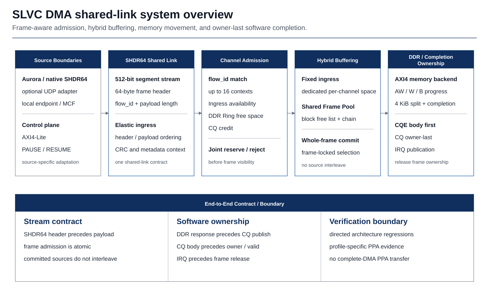
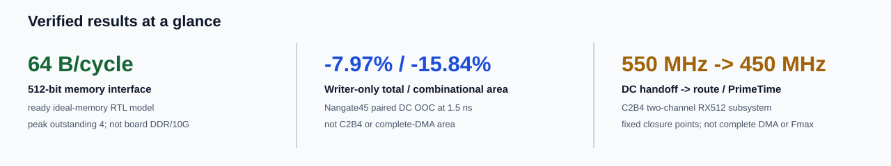
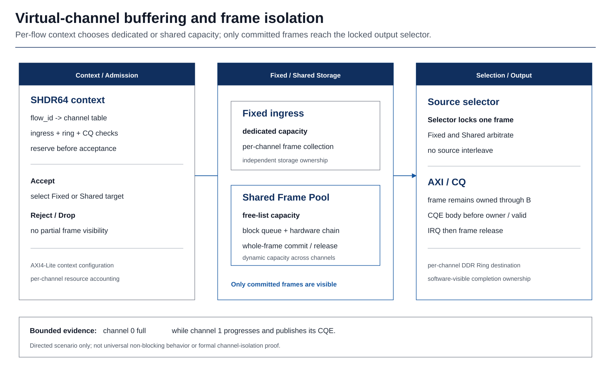

# SLVC DMA

[](https://github.com/ichigo-6301/slvc-dma-open/actions/workflows/public-integrity.yml)  [](LICENSE)

[English](README.en.md) · [架构](docs/zh-CN/architecture.md) · [集成](docs/zh-CN/integration.md) · [验证](docs/zh-CN/verification.md) · [结果](docs/zh-CN/results.md) · [限制](docs/zh-CN/limitations.md) · [功耗研究](docs/zh-CN/asic_power_storage_clock_gating_experiment.md)

> [!WARNING]
> 本分支是独立的 ASIC 功耗研究记录，不属于 `main`、`v0.1.0-rc1` 或任何生产
> Profile。实验在 Mapped-DC 层面达到预设门禁，但没有运行 P&R/CTS/Post-route
> 功耗流程，不修改生产 RTL，也不建议合入 `main`。

**面向多源共享高速链路的 512-bit 虚拟通道 DMA：在协议适配层与 DDR 之间提供 channel-aware admission、混合缓冲、独立控制消息和可审计的 completion ownership。**

多个传感器、基带处理单元或本地 endpoint 可以先复用为一条 SHDR64 segment stream。SLVC DMA 依据 header metadata 选择虚拟通道和 DDR ring，在固定通道缓冲与共享 frame pool 之间进行资源管理，并通过 Completion Queue 向软件发布完成事件。



## 60 秒总览

| 维度 | 当前实现 |
| --- | --- |
| 应用问题 | 多个带独立软件上下文的数据源共享一条高速串行或分组链路，并搬运到各自 DDR ring |
| Canonical IP | [`slvc_dma_wrapper`](rtl/integration/slvc_dma_wrapper.v)，filelist 为 [`slvc_dma_512.f`](flows/manifests/slvc_dma_512.f) |
| 数据合同 | 512-bit RX/TX AXI-Stream；64-byte SHDR64 header；最大 payload 4096 byte |
| 虚拟通道 | `flow_id` 匹配 channel context；包级 admission、reservation、ring pointer 和 completion accounting |
| 缓冲策略 | 每通道 fixed ingress buffer，或由 free list 管理的 shared frame pool |
| 流控边界 | Payload `valid/ready` 与 PAUSE/RESUME control-message 通道分离；后者不是网络端到端流控 |
| 实现证据 | Windows ModelSim + Linux Questa；Vivado routed OOC；Nangate45 DC/OpenROAD/OpenRCX/PrimeTime |

## ASIC 存储 Bank Clock Gating 研究分支

> [!WARNING]
> 本节是 `POSITIVE_MAPPED_DC / BRANCH_ONLY` 研究结果，不是 `main` 的正式
> verified claim。`promotion_eligible` 只表示通过本实验预先定义的 Mapped-DC
> 门禁；不等于生产合入建议。

本实验在两通道 C2B4 register-expanded RX512 子系统上，以相同生产 RTL closure、
500 MHz 约束、Nangate45 typical library 和确定性 workload 比较普通
`compile_ultra`（S0）与 `compile_ultra -gate_clock`（S1）。S1 只利用既有存储 Bank
写使能，没有新增或修改生产 RTL。

| 项目 | 结果 |
| --- | --- |
| Scope | 两通道 C2B4 register-expanded RX512 子系统；不是完整 DMA 或 SRAM Profile |
| Clock gates | `837 x CLKGATETST_X1`，门控 `102,976` bit |
| Gated-state coverage | `90.535515%` |
| Bursty dynamic | `-87.909999%` |
| Saturated dynamic | `-87.295325%` |
| Mapped total area | `-20.823993%` |
| Timing/electrical | S0/S1 均在 500 MHz setup/hold closed；映射电气与结构违例为 `0` |
| 决策 | 通过实验门禁；不修改生产 RTL，不建议合入 `main` |

较大的面积变化来自 DC 将逐 bit recirculation mux 转换为共享 ICG 后的映射结果，
不是 RTL 面积或 SRAM 结论。Mapped-DC clock power 也不是 CTS 后 Clock Tree Power。
本轮没有 post-route paired power，没有 LEC/Formality PASS，也不声明 Fmax、P&R、
foundry 或 signoff。与早期 576-bit Writer-only 负结果的区别及完整解释见
[中文研究说明](docs/zh-CN/asic_power_storage_clock_gating_experiment.md)。

机器入口：[English research note](docs/en/asic_power_storage_clock_gating_experiment.md) ·
[Evidence README](evidence/asic_power_clock_gating_storage_positive/README.md) ·
[points.csv](evidence/asic_power_clock_gating_storage_positive/points.csv) ·
[comparisons.csv](evidence/asic_power_clock_gating_storage_positive/comparisons.csv) ·
[category census](evidence/asic_power_clock_gating_storage_positive/category_census.csv) ·
[branch-only validator](flows/scripts/validate_asic_power_storage_clock_gating_experiment.py)

<a id="key-results-and-evidence"></a>
## 关键结果与证据入口

<!-- claim:slvc_dma_writer_reservation_component_paired_dc maturity:verified -->
<!-- claim:slvc_dma_c2b4_writer_subsystem_paired_dc maturity:verified -->
<!-- claim:slvc_dma_rx_payload_cdc_ideal_throughput maturity:verified -->
<!-- claim:slvc_dma_c2b4_n45_register_postroute_450 maturity:verified -->



| 关注点 | 架构能力 / 已核验证据 | 直接证据入口 |
| --- | --- | --- |
| 16-channel 架构 / 有界准入验证 | **架构能力：**最多 16 路 AXI-Lite 可配置 channel context，联合预留 ingress、DDR Ring 与 CQ，并支持 Fixed/Shared 混合缓存。**已核验：**一个双包、双通道定向场景，其中 channel 0 满时 channel 1 继续前进并发布 CQE | [Architecture](docs/zh-CN/architecture.md#虚拟通道生命周期) · [Verification](docs/zh-CN/verification.md#channel-admission-隔离场景) · [Results](docs/zh-CN/results.md#rtl-功能与接口吞吐) · [Evidence](evidence/slvc_dma_udp_adapter_regression_summary.yaml) |
| 512-bit AXI4 Writer 结构 / OOC 结果 | **结构改动：**按 `4 x 16` beat 上界约束 reservation 记账，将计数器由 32 bit 收窄至 7 bit，并重构其与 Payload `bytes-left`/`ready` 的组合关系。**已核验：**同库同约束 1.5 ns Writer-only paired DC 总/组合面积降低 `7.97%/15.84%`；公开 Evidence 不声明 endpoint 级路径移除 | [Architecture](docs/zh-CN/rx_payload_512_backend.md) · [Verification](docs/zh-CN/verification.md#asic-paired-dc-证据合同) · [Results](docs/zh-CN/results.md#asic-paired-dc-对比) · [CSV](evidence/asic_paired_dc/comparisons.csv) / [Manifest](evidence/asic_paired_dc/manifest.yaml) |
| RTL memory-interface throughput | ready ideal-memory 1 MiB workload 下，同频 512 与 Async512 均持续 `64 B/cycle`、W utilization `100%`、peak outstanding `4` | [Architecture](docs/zh-CN/architecture.md#rx-memory-开发-profile) · [Verification](docs/zh-CN/verification.md#rx-writer-与-cdc) · [Results](docs/zh-CN/results.md#rtl-功能与接口吞吐) · [Evidence](evidence/slvc_dma_rx_payload_cdc_regression_summary.yaml) |
| C2B4 ASIC implementation | 两通道 register-expanded RX512 子系统完成 550 MHz DC handoff 与 450 MHz route/PT；setup/hold WNS `+0.041322/+0.000341 ns`，standard-cell area `1.04207 mm²`，route DRC/antenna/electrical 为 `0` | [Architecture](docs/zh-CN/architecture.md#asic-memory-binding) · [Verification](docs/zh-CN/verification.md#asic-paired-dc-证据合同) · [Results](docs/zh-CN/results.md#asic-c2b4-register-expanded) · [Evidence](evidence/slvc_dma_c2b4_n45_register_postroute_summary.yaml) |

<a id="result-scope-levels"></a>
## 结果作用层级

| 层级 | 结果覆盖范围 | 不可外推的结论 |
| --- | --- | --- |
| Writer-only OOC | 单独综合 `dma_axi_write_engine_512`，1.5 ns paired-DC 面积结果 | 不能外推为 C2B4 或完整 DMA 面积下降 |
| C2B4 RX512 memory subsystem | 两通道、每通道 4 KiB、Shared Pool 64 blocks、register-expanded 的固定 DC/P&R/PT 实现点 | 不是完整 DMA、C4B4、SRAM 实现或 Fmax |
| 完整 SLVC DMA | 16-channel 架构、公开 RTL 与有界 directed regression | 尚无完整 DMA ASIC PPA、布局布线或 signoff claim |
| FPGA Async64 OOC | XC7Z100 上的 200 MHz routed OOC profile | 不是 bitstream、板级 DDR/10G 或 ASIC 结果 |

C2B4 Writer paired A/B **未满足 subsystem promotion 条件**：W0 本身已经闭合固定 550 MHz 测试点；完整反例和原因保留在[详细结果](docs/zh-CN/results.md#asic-paired-dc-对比)，不把负结果隐藏或改写成优化收益。

<a id="quick-public-checks"></a>
## 快速公开检查

以下命令不调用 ModelSim/Questa、Vivado、DC、OpenROAD 或 PrimeTime：

```bash
make showcase-check
make slvc_dma_512_defconfig
make sim-dry-run
make asic-evidence-check
```

`asic-evidence-check` 只校验脱敏 CSV/YAML、固定 source/tool/library/constraint 身份、marker、trace、报告哈希和 claim 边界；它不会重新运行任何商业 EDA 或物理实现工具。

安装 ModelSim/Questa 后，可通过公开 profile 运行相应 RTL 回归：

| 关注范围 | 入口 |
| --- | --- |
| Core、parser、admission、Fixed/Shared buffer | `make slvc_dma_512_defconfig sim` |
| Same-clock 512 Writer | `make slvc_dma_512_rx_wide_defconfig sim` |
| CDC bridge 与 Async64 backend | `make slvc_dma_512_rx_async64_defconfig sim` |
| CDC bridge 与 Async512 Writer | `make slvc_dma_512_rx_async512_defconfig sim` |

SpyGlass 边界保持不变：**Writer bounded scope 为 0 fatal / 0 error；完整 C2B4 common scope 未声明 clean**，详见[验证说明](docs/zh-CN/verification.md#asic-paired-dc-证据合同)。

<a id="ten-minute-rtl-reading-path"></a>
## 10 分钟 RTL 阅读路径

| 顺序 | 文件与阅读重点 |
| ---: | --- |
| 1 | [`slvc_dma_wrapper.v`](rtl/integration/slvc_dma_wrapper.v)：先看 512-bit stream、AXI-Lite、memory master、control-message 与 clock/reset 的系统边界。 |
| 2 | [`dma_rx_parser_pipe.v`](rtl/rx/dma_rx_parser_pipe.v)：看 SHDR64 解析与 metadata 发布；[`dma_rx_channel_match.v`](rtl/rx/dma_rx_channel_match.v)：看 `flow_id` 命中；[`dma_rx_channel_table.v`](rtl/rx/dma_rx_channel_table.v)：看最多 16 路静态 context 与硬件状态。 |
| 3 | [`frame_dma_rx_top.v`](rtl/integration/frame_dma_rx_top.v)：沿 staged lookup、ring/free-space、buffer/CQ credit、reservation 和 commit 阅读帧前准入。 |
| 4 | [`dma_rx_ingress_queue.v`](rtl/rx/dma_rx_ingress_queue.v)：看 per-channel Fixed ingress；[`dma_rx_frame_shared_adapter.v`](rtl/rx/dma_rx_frame_shared_adapter.v)：看 frame context；[`dma_frame_shared_pool.v`](rtl/rx/dma_frame_shared_pool.v)：看 block free list、链表和整帧 commit/release。 |
| 5 | [`dma_rx_ingress_source_selector.v`](rtl/rx/dma_rx_ingress_source_selector.v)：看 Fixed/Shared source 选择及持续到 frame end 的锁定。 |
| 6 | [`dma_axi_write_engine_512.v`](rtl/rx/dma_axi_write_engine_512.v)：看 4 KiB split、burst planner、AW/W/B 独立推进、outstanding 与 reservation credit。 |
| 7 | [`dma_rx_payload_cdc_bridge.v`](rtl/rx/dma_rx_payload_cdc_bridge.v)：看 command/payload/completion crossing；[`dma_async_fifo.v`](rtl/common/dma_async_fifo.v) 与 [`dma_async_fifo_tech.v`](rtl/common/dma_async_fifo_tech.v)：看 Gray pointer、技术映射与 reset 边界。 |
| 8 | [`tb_rtl_v33e20a107_udp_to_dma_smoke.v`](pattern/tb_rtl_v33e20a107_udp_to_dma_smoke.v)：看 channel 0 full 时 channel 1 前进及 CQE；[`tb_rtl_rx_payload_writer_512.v`](pattern/tb_rtl_rx_payload_writer_512.v)：看 2028 个 Writer directed case。 |

[进入完整 RTL 阅读指南](docs/zh-CN/rtl_reading_guide.md#ten-minute-review-path)

## 1. 背景：共享链路上的多源搬运

典型采集系统会把多个业务源汇聚到 Aurora 类串行链路、片内共享 stream，或由 MAC 输出的 packet stream。链路复用减少外部引脚和协议实例，但不会自动解决通道识别、缓冲隔离、DDR ownership、完成通知和反压传播问题。

以下比较是**定性架构分析**，不是对某个厂商 DMA 的性能 benchmark。实际 MCDMA 行为取决于调度器、每通道 queue、共享 AXI master 和软件配置。

| 方案 | 外部系统需要承担 | 隔离与共享资源 | 主要取舍 |
| --- | --- | --- | --- |
| `N x` 单通道 DMA | 外部解帧、分流、每通道 FIFO、多个 CSR/IRQ 和 AXI master 管理 | 独立实例可获得直接隔离 | 控制面和 buffer 重复，资源与集成工作随通道数增长 |
| 集中式 MCDMA 类方案 | 通常仍需匹配其 stream/channel descriptor 模型 | 隔离取决于内部 queue 和 scheduler；共享资源配置不当时可能产生 HOL/backpressure 扩散 | 实例数少，但需要验证具体 IP 的阻塞和 completion 语义 |
| SLVC DMA | 上游只需生成 SHDR64，或选用公开边界 adapter | channel-aware admission、fixed/shared buffer、独立 ring/CQ；DDR、CQ 和 shared pool 仍是有限共享资源 | 针对 shared-link segment 语义定制，并公开 RTL、回归和实现证据 |

## 2. 方案：四个实现选择

### 协议适配留在边界

原生入口是 `Aurora/native SHDR64 -> SLVC DMA`。多个本地源可由 `mcf_endpoint` 仲裁成 shared-link segment；固定 profile 的 `dma_udp_ipv4_to_shdr64_adapter` 可把 Ethernet II / IPv4 IHL=5 / UDP RX packet 转成 SHDR64。MAC/PHY、完整 Ethernet stack 和网络端到端可靠性不属于 DMA Core。

### Header 驱动虚拟通道

SHDR64 的 `flow_id` 和长度先经过 parser，再与软件配置的 channel context 匹配。只有 ring space、ingress storage 和 CQ reservation 同时满足时，frame 才越过 commit 边界。已经接收的 frame 不会被后来请求抢占其预留资源。

### 专有缓冲与共享池并存

固定 ingress 为通道保留确定容量；shared frame pool 用 block free list 让突发流量共享容量。两种 source 在 commit 后由 selector 锁定到 frame 结束，避免 512-bit payload 在 source 之间交织。

### 数据流控与控制消息分离

AXI4-Stream `valid/ready` 处理本地逐拍反压；PAUSE/RESUME 经独立 control-message/UFC 边界传递策略状态。Completion Queue 先写 body、最后发布 owner/valid，避免软件看到部分 CQE。



<!-- claim:slvc_dma_channel_admission_isolation_directed maturity:verified -->

现有 adapter-to-DMA directed smoke 精确记录了 `packets=2 channels=2 cqes=2 ch0_full_then_ch1=1`：channel 0 无可用空间时，映射到 channel 1 的 packet 仍被接收并产生预期 CQE。该结果只证明这一项 admission 场景，不是任意资源耗尽下的形式证明，也不是 MCDMA 对比实验。

[查看完整数据路径、资源边界和阻塞条件](docs/zh-CN/architecture.md)

## 3. 验证：从协议行为到物理结果

```text
directed and deterministic-random RTL regression
        -> same-clock / dual-clock RX memory profiles
        -> Vivado synth / place / phys-opt / route OOC
        -> Design Compiler mapped handoff
        -> OpenROAD detail route / same-run OpenRCX SPEF
        -> PrimeTime internal setup / hold STA
```

公开回归覆盖 parser、channel admission、fixed/shared buffer、descriptor、CQ ownership、4 KiB AXI boundary、tail WSTRB、random backpressure、reset/drain、CDC FIFO 和 writer outstanding。它是有界 directed verification，不等价于 formal proof、coverage closure 或完整 CDC/RDC signoff。

[查看验证矩阵与精确 PASS marker](docs/zh-CN/verification_matrix.md)

## 4. 当前已核验结果

<!-- claim:slvc_dma_rx_payload_cdc_regression maturity:verified -->
<!-- claim:slvc_dma_async64_vivado_2022_2_ooc_200m maturity:verified -->

| 层级 | Profile 与 workload | 已核验结果 | 成熟度边界 |
| --- | --- | --- | --- |
| RTL / memory interface | 512 writer `2028` cases；1 MiB ideal-memory workload | 同频 512 与 async512 均为 `64 B/cycle`、W 利用率 `100%`、peak outstanding `4` | RTL/model interface rate，不是板级 DDR 或无损网络吞吐 |
| FPGA | Async64，Vivado 2022.2，`xc7z100ffg900-2`，200 MHz routed OOC | WNS/WHS `+0.152/+0.059 ns`；39,299 LUT、43,671 FF、54 BRAM tiles | 保留 52 条分类 OOC DRC warning；不是 bitstream 或板级实现 |
| ASIC | C2B4 register-expanded RX512；550 MHz DC handoff -> 450 MHz route/PT | PT setup/hold WNS `+0.041322/+0.000341 ns`；DRC/antenna/electrical `0` | 两通道 internal memory subsystem；不是 C4B4、完整 DMA 或 Fmax |

C2B4 同次 route 的 die 为 `1684.865 x 1684.865 um`（`2.83877 mm^2`），core 为 `1644.640 x 1643.600 um`（`2.70313 mm^2`）；standard-cell area 为 `1.04207 mm^2`，core utilization 为 `38.5506%`。这里的 die 是两通道 RX512 memory-subsystem 的 implementation block 边界，不是封装芯片面积。

证据：[RTL/CDC regression](evidence/slvc_dma_rx_payload_cdc_regression_summary.yaml) · [Vivado 2022.2 OOC](evidence/slvc_dma_async64_vivado_2022_2_ooc_summary.yaml) · [C2B4 post-route](evidence/slvc_dma_c2b4_n45_register_postroute_summary.yaml)

## 5. SRAM 研究进展与当前阻塞

<!-- claim:slvc_dma_sram_a5_clock_delivery_canary maturity:verified -->
<!-- claim:slvc_dma_sram_a5_256_area_reduction maturity:verified -->

SRAM A5 是独立的 `partial/blocked` 研究路线，不与上方完成闭合的结果混列。经过审计的 512x128 OpenRAM model 和 routed boundary canary 使用 `d200 + macro_x3`，把 macro clock slew 从 `86.384 ps` 降到 `16.434 ps`；生成的 256x128 macro 面积比 512x128 小 `37.74%`。

当前 proxy minimum-pulse 仍为 `1.5625 ns`，independent true-pulse characterization 尚未完成，因此 C4B4 SRAM DC/P&R/PT 没有启动。面积降低也不能直接扩展为 performance、power 或完整 PPA 改善。

[查看 SRAM model、clock delivery 与 nonclaim](docs/zh-CN/asic_implementation.md)

## 选择集成入口

| 目标 | Canonical top / boundary | 配置与检查 |
| --- | --- | --- |
| 完整 512-bit Shared-Link DMA | [`slvc_dma_wrapper`](rtl/integration/slvc_dma_wrapper.v) | [`slvc_dma_512.f`](flows/manifests/slvc_dma_512.f) · `make sim-dry-run` |
| FPGA OOC timing top | [`frame_dma_wrapper`](rtl/integration/frame_dma_wrapper.v) | `make fpga-ooc-dry-run` |
| 固定 Ethernet/IPv4/UDP RX adaptation | [`dma_udp_ipv4_to_shdr64_adapter`](rtl/adapters/dma_udp_ipv4_to_shdr64_adapter.v) -> `slvc_dma_wrapper` | 默认 defconfig · [协议边界](docs/zh-CN/udp_ipv4_adapter.md) |
| 同频或双时钟 RX memory backend | [`frame_dma_rx_top`](rtl/integration/frame_dma_rx_top.v) | `slvc_dma_512_rx_{wide,async64,async512}_defconfig` |

[查看端口、时钟/reset、bring-up 和 ownership 合同](docs/zh-CN/integration.md)

## 文档与发行边界

[接口](docs/zh-CN/interfaces.md) · [RTL 阅读指南](docs/zh-CN/rtl_reading_guide.md) · [双时钟后端](docs/zh-CN/rx_payload_cdc_backends.md) · [FPGA 实现](docs/zh-CN/fpga_implementation.md) · [ASIC 实现](docs/zh-CN/asic_implementation.md) · [Delivery 状态](docs/zh-CN/delivery_status.md) · [Evidence](provenance/evidence.yaml) · [Claims](provenance/claims.yaml)

当前 `main` 是 `v0.1.0-rc1` 之后的展示与开发线。不可变 annotated tag `v0.1.0-rc1` 仍固定原始 release source、evidence 和 checksum，不因本轮文档更新而移动或重建。完整 nonclaim 见[限制](docs/zh-CN/limitations.md)与[公开范围](PUBLIC_SCOPE.md)。
