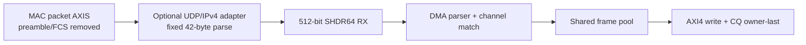

# Architecture

The data path comprises the shared segment stream, RX parser/channel match,
frame pool, AXI4 write engine, CQ writer, and TX replay. `slvc_dma_wrapper`
is the generic integration top; `frame_dma_wrapper` is the FPGA OOC timing top.

RX parses the fixed 64-byte SHDR64 header, admits the segment by channel
metadata, and writes payload into the target DDR ring. CQ body data is written
before owner/valid becomes visible. TX reads a descriptor payload from DDR and
generates a new SHDR64 segment.

The carrier adapter and MCF endpoint are boundary modules. The former adapts
an optional physical carrier; the latter can aggregate local sources. Neither
changes DMA DDR or CQ ownership semantics.

The optional `dma_udp_ipv4_to_shdr64_adapter` is another upstream boundary. It
accepts a fixed 512-bit Ethernet II / IPv4 / UDP packet profile, constructs the
SHDR64 header, and repacks payload beginning at byte 42. It is not part of
`frame_dma_wrapper`, so the frozen core FPGA OOC result excludes adapter logic.

