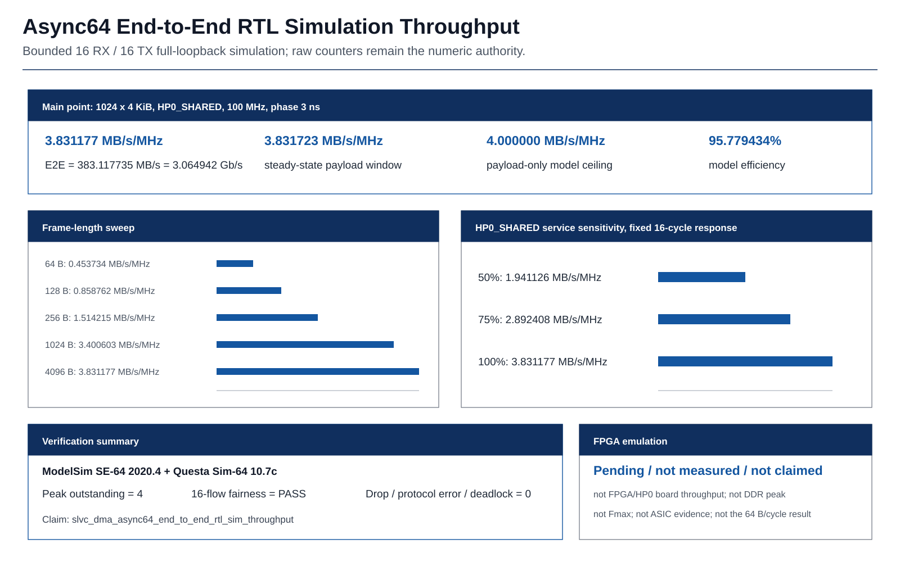

# Verified Results

## Interpretation

- `verified` applies only to the recorded source, profile, tool, and workload, not every parameter combination.
- RTL ideal-memory throughput, FPGA routed OOC, DC synthesis estimates, and post-route PrimeTime are different methodologies and cannot be collapsed into one PPA conclusion.
- Frequencies are fixed tested points, not Fmax claims.
- C2B4 is a two-channel RX512 memory subsystem, not C4B4 or the complete DMA.
- Board DDR/10G, power, IO timing, OCV/MMMC, foundry signoff, and silicon readiness are not claimed.

All source commits, tool identities, artifact SHA-256 values, and caveats are under `evidence/` and `provenance/`.

## RTL Function And Interface Throughput

<!-- claim:slvc_dma_rx_payload_cdc_regression maturity:verified -->
<!-- claim:slvc_dma_rx_payload_cdc_ideal_throughput maturity:verified -->
<!-- claim:slvc_dma_channel_admission_isolation_directed maturity:verified -->

Windows ModelSim 2020.4 and Linux Questa 10.7c pass the fixed markers for the frozen core, adapter, same-clock 512, async64, async512, and C2 focused regressions at their evidence-bound commits.

| Test | Fixed result | Interpretation boundary |
| --- | --- | --- |
| 512-bit writer | `PASS tb_rtl_rx_payload_writer_512 cases=2028` | Length, tail, 4 KiB, outstanding, backpressure, error, reset, and throughput |
| Writer integration | `directed_lengths=18 mixed_frames=256` | Fixed/shared source selection and completion ordering |
| Channel admission | `packets=2 channels=2 cqes=2 ch0_full_then_ch1=1` | Only one directed progress scenario while channel 0 ring space is unavailable |
| CDC bridge | `frames=452 bytes=925001 clock_profiles=6 clock_stops=2` | Directed/deterministic stress, not complete CDC/RDC signoff |
| Async backend stress | `2000` frames each for async64 and async512 | Response errors, clock/reset, and randomized backpressure |

Ideal 1 MiB memory-model interface throughput is:

| Profile | AXI bytes/cycle | W utilization | Peak outstanding | Interface rate at 200 MHz |
| --- | ---: | ---: | ---: | ---: |
| Same-clock 512 | 64 | 100% | 4 | 12.8 GB/s |
| Async64 | 8 | 100% | 4 | 1.6 GB/s |
| Async512 | 64 | 100% | 4 | 12.8 GB/s |

Async64 issues 8,192 16-beat bursts and observes 8,192 planner bubble cycles. Four outstanding slots hide those AW intervals from W-channel delivery. These are ready-memory-model RTL/interface rates, not measured board DDR throughput.

Evidence: [RX memory regression](../../evidence/slvc_dma_rx_payload_cdc_regression_summary.yaml) · [Adapter regression](../../evidence/slvc_dma_udp_adapter_regression_summary.yaml)

## FPGA Routed OOC

### Vivado 2022.2 Async64

<!-- claim:slvc_dma_async64_vivado_2022_2_ooc_200m maturity:verified -->

| Profile | WNS | TNS | WHS | THS | LUT | FF | BRAM tiles | DRC warning entries |
| --- | ---: | ---: | ---: | ---: | ---: | ---: | ---: | ---: |
| Async64, 200 MHz | +0.152 ns | 0 | +0.059 ns | 0 | 39,299 | 43,671 | 54 | 52 |

This run uses Vivado 2022.2, `xc7z100ffg900-2`, 5.000 ns `aclk/mem_clk`, and `ExtraNetDelay_high / AggressiveExplore / Explore`. Failed, unrouted, and partially routed net counts are zero. All four Gray-bus constraints pass, with +4.431 ns worst bus-skew slack.

The 52 OOC DRC warnings remain classified under CHECK/RBOR/REQP/RTSTAT/ZPS7, so zero DRC, bitstream, and board implementation are not claimed. These values are not numerically merged with Vivado 2018.3.

Evidence: [Vivado 2022.2 Async64 summary](../../evidence/slvc_dma_async64_vivado_2022_2_ooc_summary.yaml)

### Vivado 2018.3 RX Memory Development Profiles

All profiles below use `xc7z100ffg900-2` and 5.000 ns. They are independent development results and do not replace the 2022.2 run above.

| Profile | WNS | TNS | WHS | THS | LUT | FF | RAMB36 | RAMB18 | DSP |
| --- | ---: | ---: | ---: | ---: | ---: | ---: | ---: | ---: | ---: |
| Same-clock 512 | +0.089 ns | 0 | +0.069 ns | 0 | 38,045 | 42,514 | 44 | 3 | 0 |
| Async64 | +0.109 ns | 0 | +0.065 ns | 0 | 39,554 | 43,562 | 52 | 4 | 0 |
| Async512 | +0.060 ns | 0 | +0.058 ns | 0 | 40,020 | 43,316 | 52 | 4 | 0 |

The same-clock netlist contains zero RX-payload CDC cells. Both async profiles have no unconstrained internal endpoint, no Critical CDC entry, and pass Gray-pointer bus-skew checks. The four optimized Async64 strategies report WNS `+0.138/+0.122/+0.109/+0.223 ns`; the pre-pipeline `+0.004/+0.003/-0.019/-0.004 ns` matrix remains retained as baseline evidence.

### Frozen-Core Vivado 2018.3

| Strategy | WNS | WHS | LUT | FF | RAMB36 | RAMB18 | DSP |
| --- | ---: | ---: | ---: | ---: | ---: | ---: | ---: |
| Explore | +0.226 ns | +0.045 ns | 38,074 | 40,787 | 44 | 3 | 0 |
| Performance_Explore | +0.173 ns | +0.046 ns | 38,087 | 40,787 | 44 | 3 | 0 |
| ExtraNetDelay_high | +0.162 ns | +0.054 ns | 38,088 | 40,785 | 44 | 3 | 0 |

All three routed OOC runs have zero TNS and THS. The optional UDP adapter is outside `frame_dma_wrapper`, so these frozen-core resource values exclude adapter logic.
<!-- fpga-emulation-publication:slvc_dma_u5_sync_hp0_loopback_board_throughput:start -->
## Single FPGA Board Observation

<!-- claim:slvc_dma_u5_sync_hp0_loopback_board_throughput maturity:partial -->

The synchronous PL-local loopback on XC7Z100 uses a 13 RX/13 TX compile identity, TX0 through a 512-bit AXIS register slice to RX0, a 100 MHz PL clock, and the existing 64-bit PS HP0 port. One 1024 x 4096-byte workload produced operator-transcribed debugger counters of 4,194,304 payload bytes and 8,969,535 XTime ticks; 2,690,860 is the rounded 100 MHz equivalent cycle count. Direct `Decimal` recomputation from the unrounded tick rational gives a post-start completion-window rate of `1.558722 MB/s/MHz`, `155.872225 MB/s`, and `1.246978 Gb/s` (shown as `1.247 Gb/s` at three decimals on the homepage), or `38.968056%` of the conservative 4 B/cycle shared-HP0 model ceiling.

The result is `FPGA_DEBUGGER_TRANSCRIBED_SINGLE_RUN` / `partial`. The timer starts after the descriptor-start write returns, so launch latency is excluded and this is not a hardware end-to-end rate. The breakpoint is after timing stops and after CQ, payload, resource-release, and error checks; the incomplete UART tail is not a numeric source. No independent screenshot or memory export, source-to-binary build trace, Async64 CDC board result, Aurora performance, DDR peak, Fmax, 64 B/cycle Writer result, ASIC evidence, or repeatability statistics is claimed, and the result is not resume eligible. Evidence: [summary](../../evidence/slvc_dma_u5_sync_hp0_loopback_summary.yaml) · [package](../../evidence/fpga_emulation/u5_sync_hp0_loopback/README.md).
<!-- fpga-emulation-publication:slvc_dma_u5_sync_hp0_loopback_board_throughput:end -->

## ASIC C2B4 Register-Expanded

<!-- claim:slvc_dma_c2b4_n45_register_postroute_450 maturity:verified -->

Profile `dma_rx512_reg_c2_b4_m2_sp64` uses two channels, 4 KiB fixed payload per channel, metadata depth two, and a 64-block shared pool. All 102,400 payload/keep bits remain registers and the SRAM macro count is zero.

| Stage | Target | Setup WNS/TNS | Hold WNS/TNS | Other gates |
| --- | ---: | --- | --- | --- |
| Design Compiler handoff | 550 MHz | +0.000284 ns / 0 | +0.044102 ns / 0 | 113,741 registers; zero design-rule violations |
| OpenROAD/OpenRCX/PrimeTime | 450 MHz | +0.041322 ns / 0 | +0.000341 ns / 0 | route DRC 0; antenna 0; electrical 0; coverage 100% |

The 600 MHz DC stress point reports setup WNS/TNS `-0.0554587 ns / -5.93551556 ns` across 388 violating paths. This is a timing failure, not a tool crash. The 550 MHz mapped netlist is the physical handoff.

Physical metrics from the same 450 MHz route are:

| Die | Core | Standard-cell area | Cell count | Core utilization |
| --- | --- | ---: | ---: | ---: |
| 1684.865 x 1684.865 um (`2.83877 mm^2`) | 1644.640 x 1643.600 um (`2.70313 mm^2`) | `1.04207 mm^2` | 555,849 | 38.5506% |

This block contains only the RX512 memory subsystem. PrimeTime uses a nominal single corner and 0 ns physical hold uncertainty. The result excludes top-level IO timing, OCV/MMMC, power, and foundry extraction.

Evidence: [C2B4 same-run post-route summary](../../evidence/slvc_dma_c2b4_n45_register_postroute_summary.yaml)

## ASIC Paired-DC Comparisons

The following comparisons use Design Compiler O-2018.06-SP1, the same
Nangate45 typical library DB, and identical constraints within each pair.
`points.csv` is the numeric authority; all deltas below are regenerated by the
public validator with decimal arithmetic.

<!-- claim:slvc_dma_writer_reservation_component_paired_dc maturity:verified -->

| Pair and scope | Period | Baseline -> candidate | Result |
| --- | ---: | --- | --- |
| Writer reservation, component OOC | 1.500 ns | W0 -> W1 | total cell area `7526.204 -> 6926.640` (`-7.966353%`); combinational area `-15.838902%`; both setup-closed |

The Writer result applies only to `dma_axi_write_engine_512`. It does not
measure the C2B4 subsystem or the complete DMA.

<!-- claim:slvc_dma_c2b4_writer_subsystem_paired_dc maturity:verified -->

| Pair and scope | Period | Baseline -> candidate | Result |
| --- | ---: | --- | --- |
| C2B4 register-expanded RX512 subsystem | 1.818182 ns | W0 -> W1 | both setup-closed; Writer hierarchy area `4637.976 -> 7160.720` (`+54.393209%`); setup WNS `+0.001498 -> +0.000959 ns` |

W0 already closes this fixed 550 MHz point, while W1 increases Writer
hierarchy area and reduces timing margin. The subsystem promotion condition is
therefore not met. W2 is retained only as a numeric anchor match, not as a
methodology-identical reproduction of the historical handoff.

<!-- claim:slvc_dma_shared_pool_scheduler_paired_dc maturity:verified -->

| Pair and scope | Period | Baseline -> candidate | Result |
| --- | ---: | --- | --- |
| Register-expanded Shared Pool component OOC | 2.500 ns | P6 -> P7 | setup WNS `+0.001163 -> +0.008876 ns` (`+7.71332 ps`); registers `+52`; total area `+0.019194%` |

The Shared Pool comparison quantifies a scheduler timing-margin improvement
and discloses its register and area cost. It is not SRAM-macro PPA.

Evidence: [sanitized ASIC paired-DC bundle](../../evidence/asic_paired_dc/README.md)

## SRAM A5 Research

<!-- claim:slvc_dma_sram_a5_clock_delivery_canary maturity:verified -->
<!-- claim:slvc_dma_sram_a5_256_area_reduction maturity:verified -->

SRAM A5 remains `partial/blocked`:

| Item | Completed result | Open boundary |
| --- | --- | --- |
| 512x128 model | TT/1.1 V/25 C transistor-level trimmed-SPICE 4x4 table with 80 ps / 4.182 fF coverage | Analytical/OpenRAM reference flow; macro DRC/LVS/PEX open |
| Clock-delivery canary | `d200 + macro_x3` reduces macro clock slew `86.384 -> 16.434 ps`; positive setup/hold; DRC/antenna/RC-004 0 | Four proxy minimum-pulse violations |
| 256x128 generation | Macro area `195801.79 -> 121909.43 um^2`, a 37.7383% reduction | Full 4x4 characterization, performance, and power unverified |

Both macro organizations retain a 1.5625 ns proxy high/low minimum pulse. This blocks the 300 MHz C4B4 start. Independent true-pulse characterization is incomplete, so the model cannot be promoted by a waiver or text substitution.

Evidence: [SRAM A5 development summary](../../evidence/slvc_dma_sram_a5_development_summary.yaml)

## Design Compiler Frontend Reference

Async64 at 5.000 ns OOC synthesis reports source/memory setup WNS `+2.948/+1.682 ns`, hold WNS `+0.039 ns`, area 172,104.93, 20,602 registers, and zero latches. Async512 source is unchanged and retains its prior `+3.011/+1.393 ns` setup WNS and 170,410.51 area. Generic FIFO arrays are included, so these values are not macro-backed ASIC PPA.

The writer-only OOC sweep uses DC O-2018.06-SP1, Nangate45 typical, 0.200 ns setup uncertainty, and 0.050 ns hold uncertainty:

| Target period | Setup WNS | Hold WNS | Cell area | Leaf cells |
| ---: | ---: | ---: | ---: | ---: |
| 5.000 ns | +2.059 ns | +0.047 ns | 6,860.41 | 3,352 |
| 3.333 ns | +0.393 ns | +0.047 ns | 6,860.67 | 3,352 |
| 2.500 ns | +0.028 ns | +0.047 ns | 6,579.24 | 2,764 |
| 2.000 ns | +0.013 ns | +0.046 ns | 6,669.95 | 2,795 |
| 1.500 ns | +0.013 ns | +0.046 ns | 6,795.24 | 2,975 |
| 1.250 ns | -0.033 ns | +0.046 ns | 7,195.57 | 3,622 |

Each target recompiles the design, so non-monotonic area/slack is expected. 1.500 ns is the last setup-closed tested point and 1.250 ns is the first failure. This is not routed Fmax or a complete-DMA result.
<!-- throughput-publication:slvc_dma_async64_end_to_end_rtl_sim_throughput:start -->
<!-- claim:slvc_dma_async64_end_to_end_rtl_sim_throughput maturity:verified -->

3.831177 MB/s/MHz; 383.117735 MB/s; 3.064942 Gb/s; 95.779434%. Pending / not measured / not claimed.
<!-- throughput-publication:slvc_dma_async64_end_to_end_rtl_sim_throughput:end -->
