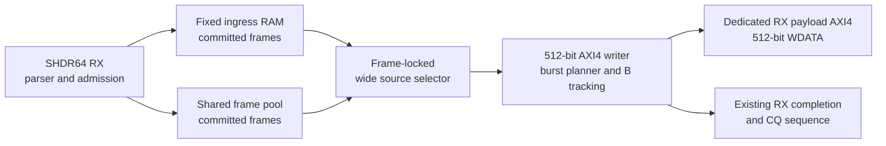

# Optional 512-bit RX Payload Backend

This development profile adds a dedicated same-clock 512-bit AXI4 write
master for RX payload traffic. It does not alter SHDR64 parsing, channel match,
admission, ring accounting, frame-pool commit, CQ publication, TX, or
descriptor semantics. The frozen release profile keeps the legacy 64-bit
memory path as its default.

## Datapath Boundary



Both ingress backends expose a complete-frame `TVALID/TREADY` stream only
after their existing commit point. The selector locks the chosen backend until
the frame completes. The fixed ingress path reads its existing 512-bit payload
RAM directly; the shared-pool path preserves the already-prefetched first beat
and then forwards the pool drain stream. No second full-frame payload store is
introduced.

The writer requires a 64-byte-aligned destination address, emits fixed
`AWSIZE=6` INCR bursts, limits a burst to 16 beats, splits at 4 KiB boundaries,
and derives the final `WSTRB` from the true payload length. AW, W, and B
handshakes are independent, with up to four ordered write responses in flight.
A frame completion is published only after all accepted bursts receive B
responses.

## Profile Selection

The feature is default-off and compiled into `frame_dma_rx_top` only with
`DMA_RX_WIDE_PAYLOAD_PROFILE`. The public flow selects it through
`configs/slvc_dma_512_rx_wide_defconfig`:

```text
python3 flows/scripts/flowctl.py defconfig --source configs/slvc_dma_512_rx_wide_defconfig
python3 flows/scripts/flowctl.py show-config
python3 flows/scripts/flowctl.py sim-dry-run
python3 flows/scripts/flowctl.py fpga-ooc-dry-run
```

That profile runs ten frozen-core regressions plus two wide-backend tests. It
does not enable the optional UDP/IPv4 adapter tests.

## Clocking And CDC Bypass

This profile assumes the ingress, writer, and dedicated AXI master share
`aclk`. Its generate branch contains no command, payload, completion FIFO, or
reset synchronizer; the synthesized audit reports zero RX payload CDC cells.

Separate async64 and async512 profiles now implement the explicit command,
512-bit payload, and completion crossing while keeping AXI in `mem_clk`. See
[Optional Dual-Clock RX Payload Backends](rx_payload_cdc_backends.md).

Same-clock soft reset remains the existing local synchronous destructive
contract. Arbitrary width profiles, unaligned first-beat shifting, TX/CQ
widening, and multi-port striping are not implemented.

## Measured Development Results

The standalone ModelSim/Questa test covers directed boundary lengths across
the 1-through-4096-byte range, alignment and 4 KiB boundaries, response errors, random channel
backpressure, reset/restart, 2,000 random frames, and a 1 MiB throughput run.
The integration test covers 18 directed lengths and 256 mixed fixed-ingress and
shared-pool frames.

In the ideal AXI memory model, the 1 MiB run observed 16,384 active W beats in
16,384 W-active cycles: 64 byte/cycle, 100% W-channel utilization, 16-beat
average bursts, and four peak outstanding bursts. At 200 MHz this corresponds
to the 12.8 GB/s interface rate. It is RTL/model throughput, not measured DDR
bandwidth.

Vivado 2018.3 routed `frame_dma_rx_top` for `xc7z100ffg900-2` at 5.000 ns with
`+0.029 ns` setup WNS, zero TNS, `+0.052 ns` hold WNS, and zero THS. Routed
utilization was 38,595 LUT, 42,492 FF, 44 RAMB36, 3 RAMB18, and 0 DSP. The
same-clock CDC absence report found zero RX payload CDC cells.

Writer-only Design Compiler OOC synthesis used O-2018.06-SP1 and the Nangate45
typical library. The wide writer closed 5.000 ns with `+2.059 ns` setup WNS and
closed 1.500 ns with `+0.013 ns`; 1.250 ns was the first tested failure at
`-0.033 ns`. This is a bounded synthesis sweep, not routed ASIC Fmax or
signoff. See [Verified Results](results.md) for the comparison table and full
claim boundary.
