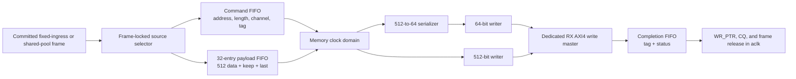

# Optional Dual-Clock RX Payload Backends

These development profiles move only committed RX payload traffic to a
separate memory clock domain. SHDR64 parsing, channel match, admission, frame
storage, completion queue publication, TX, descriptors, and the frozen public
wrappers retain their existing clocking and software-visible behavior.

## Profile Matrix

| Profile | RX memory clock | RX AXI WDATA | CDC path | Defconfig |
| --- | --- | ---: | --- | --- |
| Frozen/default | `aclk` | 64 bit | none | `slvc_dma_512_defconfig` |
| Same-clock wide | `aclk` | 512 bit | generate bypass | `slvc_dma_512_rx_wide_defconfig` |
| Async64 | `mem_clk` | 64 bit | command + 512-bit payload + completion | `slvc_dma_512_rx_async64_defconfig` |
| Async512 | `mem_clk` | 512 bit | command + 512-bit payload + completion | `slvc_dma_512_rx_async512_defconfig` |

Only the two discrete memory widths above are implemented. This is not an
arbitrary 64/128/256/512-bit parameterization.

## Datapath And Ownership

AXI AW, W, and B never cross the clock boundary independently. The complete
writer is in `mem_clk`; only a frame command, ordered 512-bit payload beats,
and one completion cross. The source remains locked until the matching tagged
completion returns, so a frame is not released before all B responses have
completed.

The bridge uses an 8-bit transaction tag and accepts one frame at a time. A
completion-tag mismatch becomes error code 7 and latches a protocol error.
Command and completion use four-entry Gray-pointer FIFOs. Payload uses a
32-entry, 577-bit FIFO containing `TDATA`, `TKEEP`, and `TLAST`.

## Memory-Domain Writers

Async64 performs `512 -> 64` serialization after CDC. It emits `AWSIZE=3`, up
to 16 beats per burst, splits at 4 KiB boundaries, supports four ordered
outstanding responses, and sustains one 64-bit W beat per `mem_clk` when the
memory model is ready.

Its AW planner has one registered candidate stage containing valid, address,
and beat count (41 bits total). The planner fills that stage only after source
credit, plan-queue space, outstanding space, and the 4 KiB-limited burst length
are known. AXI AW outputs load only from the registered candidate; issue address,
remaining beats, plan-queue state, outstanding count, and source reservation
advance only on `AWVALID && AWREADY`. A stalled AW therefore remains stable.
The simple refill policy inserts one planner interval per burst, while the
16-beat bursts and four outstanding slots preserve continuous ideal-model W
traffic.

Async512 reuses `dma_axi_write_engine_512` in `mem_clk`. It emits `AWSIZE=6`,
uses 64-byte-aligned destinations, and preserves the same burst, response, and
completion rules. It may issue AW before a complete payload burst has reached
the read side; W remains valid/ready backpressured. This removes a long
occupancy/4-KiB planning cone without weakening AXI or completion ordering.

## Reset Contract

Hard reset is asynchronously asserted and synchronously deasserted in each
domain. The current profiles require `aresetn` and `mem_aresetn` to be asserted
together; arbitrary one-sided hard-reset recovery is unsupported and checked
in simulation.

Soft reset is a bounded quiesce-and-drain protocol at the integrated top. The
first request is latched and repeated writes are coalesced. Quiesce blocks new
RX headers, TX channel or descriptor launches, and new UFC work while allowing
an already accepted RX frame and already started TX, CQ, UFC, and AXI work to
finish. Committed fixed-ingress and shared-pool frames continue to drain.

The drain decision covers the RX and writer state machines, registered ingress
and CQ occupancy reductions, all three CDC channels, the memory backend, AXI
outstanding work, CQ reservations, the TX scheduler, and UFC output. Idle must
be observed for two consecutive `aclk` cycles. The top then sends one reset
request toggle to `mem_clk`; the memory side acknowledges it only while its
bridge, serializer, and writer are idle. The acknowledged event commits the
local synchronous resets in both domains and releases quiesce.

Completion is bounded when both clocks continue running and every external AXI,
CQ, and stream sink eventually accepts pending work. A stopped clock or
permanent downstream backpressure intentionally leaves reset pending rather
than discarding an in-flight transaction.

`DEBUG_STATE[2:5]` exposes pending, quiescing, drain-done, and CDC protocol-error
state. A CDC protocol error also sets `GLOBAL_STATUS[13]`, increments the global
error counter once per rising event, and raises the existing AXI-error IRQ. The
CQE format is unchanged.

Protocol errors are checked at the attempted-valid boundary, not only after a
valid/ready transfer. Ready is intentionally low for payload outside an
accepted command-to-TLAST window and for completion without an active memory
command, so a fire-qualified check cannot observe those violations. Payload
held stable while an active frame is legally backpressured remains valid and
does not raise an error. Directed tests cover payload without command, payload
after TLAST, completion without command, duplicate completion, and a
memory-backend error.

## Technology Binding

`dma_async_fifo_tech` is the common boundary. Vivado OOC selects XPM for the
32-entry payload FIFO, allowing block-RAM mapping; the four-entry command and
completion FIFOs use the verified generic Gray-pointer implementation because
Vivado 2018.3 XPM requires a deeper FIFO. Simulation and the ASIC OOC profile
use generic RTL arrays.

The aggregate modeled storage is 18,948 bits. Design Compiler includes those
generic arrays as standard-cell storage, so its area is not comparable to a
macro-backed ASIC implementation or to the writer-only same-clock result.

### Gray-Pointer Constraints

The project explicitly constrains both Gray-pointer directions in each generic
command and completion FIFO. For a 5.000 ns/5.000 ns run this produces four
`set_max_delay -datapath_only 5.000` constraints and four `set_bus_skew 5.000`
constraints, covering 12 source registers and 12 first-stage synchronizer
registers. The limit is derived from `min(aclk_period, mem_clk_period)` rather
than being fixed to 5 ns. The script fails closed if a FIFO, bus, source, or
destination register is missing, and it verifies the routed exception and bus
skew reports. XPM payload-FIFO crossings are deliberately excluded because
they retain Xilinx-owned structures and constraints.

Vivado does not use a blanket asynchronous clock group for these profiles:
that exception would override the project max-delay constraints and trigger
`TIMING-24`. Instead, the flow discovers actual non-Gray crossing endpoints
and applies point-to-point false paths to 73 `aclk -> mem_clk` and 12
`mem_clk -> aclk` endpoints while protecting 12 project and 56 XPM Gray
synchronizer destinations. The methodology gate requires zero `TIMING-24`,
`XDCB-1`, and `XDCV-1` findings. Async64 retains three documented `PDRC-190`
synchronizer-placement warnings; async512 retains none.

For each asynchronous profile, `report_cdc` classifies 3/5 directional
`CDC-3` entries as legal two-stage single-bit toggle/status/reset or single-bit
Gray synchronizers. The 2/2 directional `CDC-6` entries are the four project
Gray-pointer buses covered by max-delay and bus-skew constraints. The 72/9
directional `CDC-15` entries are generic FIFO data words sampled only after
synchronized pointer ownership. They are expected clock-enabled FIFO data
structures but remain a non-signoff caveat. The XPM payload FIFO retains
Xilinx-owned pointer/reset structures and constraints and is deliberately not
reconstrained by the project script. Critical CDC count is zero; this
classification is not a complete CDC/RDC waiver package.

## Verification And Measured Results

Each asynchronous profile schedules ten frozen-core tests plus three RX-backend
test commands. The integration command emits a second exact quiesce marker.
Async64 also emits an exact AW-planner marker from the backend command, so its
RX portion requires five markers and the full profile requires fifteen.
Async512 still requires four RX markers and fourteen total. The common
bridge test covers 452 frames, six clock profiles, clock stops, FIFO full/empty
pressure, tag accounting, five reachable protocol-error cases, and 925,001
bytes. Each backend test covers 2,000 random frames plus directed lengths,
4 KiB splits, AW/W/B backpressure, response errors, reset/restart, and
byte-accurate memory comparison. Async64 adds 21 directed lengths, 4 KiB
offsets `000/f80/fc0/ff0/ff8`, AWREADY stalls of 1/2/7/31 cycles, source-credit
zero/short/exact/surplus cases, and simultaneous AW/B/source/plan-pop events.
The integration test covers 18 directed
lengths, 256 mixed source frames, continuous RX quiesce, fixed/shared queue
drain, payload and CQ AW/W/B stalls, both clock stops, repeated reset requests,
UFC drain, and a header already accepted into the elastic FIFO while the parser
is paused by release maintenance.
TX launch suppression, active-TX drain, exactly one local reset after drain,
sustained pending-descriptor suppression, and a clean restart are checked by
the frozen-core TX pipeline test; the integration marker itself covers the
RX/CQ/clock/UFC scenarios listed above.

The ideal 1 MiB runs measured:

| Profile | AXI bytes/cycle | W utilization | Peak outstanding | Interface rate at 200 MHz |
| --- | ---: | ---: | ---: | ---: |
| Same-clock 512 | 64 | 100% | 4 | 12.8 GB/s |
| Async64 | 8 | 100% | 4 | 1.6 GB/s |
| Async512 | 64 | 100% | 4 | 12.8 GB/s |

Async64 issued 8,192 sixteen-beat bursts and observed 8,192 planner-bubble
cycles without a W-channel bubble. These are RTL/model interface rates, not
board DDR measurements.

Vivado 2018.3 routed `frame_dma_rx_top` on `xc7z100ffg900-2` with 5.000 ns
`aclk` and `mem_clk`:

| Profile | WNS | TNS | WHS | THS | LUT | FF | RAMB36 | RAMB18 | DSP |
| --- | ---: | ---: | ---: | ---: | ---: | ---: | ---: | ---: | ---: |
| Same-clock 512 | +0.089 ns | 0 | +0.069 ns | 0 | 38,045 | 42,514 | 44 | 3 | 0 |
| Async64 | +0.109 ns | 0 | +0.065 ns | 0 | 39,554 | 43,562 | 52 | 4 | 0 |
| Async512 | +0.060 ns | 0 | +0.058 ns | 0 | 40,020 | 43,316 | 52 | 4 | 0 |

The same-clock netlist audit found zero RX payload CDC cells. Both asynchronous
profiles have no unconstrained internal endpoint or Critical CDC entry, and all
reported Gray-pointer bus-skew constraints are met. Same-clock 512 and async512
retain their three source-identical setup/hold-closed strategies; they were not
rerouted for the async64-only edit. Async64 closed all four newly measured
strategies with WNS `+0.138/+0.122/+0.109/+0.223 ns`, TNS/THS zero, and minimum
WHS `+0.065 ns`. Its pre-pipeline `+0.004/+0.003/-0.019/-0.004 ns` matrix remains
explicit baseline evidence. The former
`issue_beats_left_q -> m_axi_awaddr/CE` path is absent from all optimized
top-100 reports; the selected global worst path is now ingress payload-RAM
address routing. A planner-internal path remains noncritical at `+0.268 ns`.
Vivado still reports
structural CDC warnings for recognized Gray buses and clock-enabled FIFO data,
plus the async64 placement warnings noted above; these are documented
structures, not a blanket CDC signoff waiver.

Design Compiler OOC at 5.000 ns closed both asynchronous profiles:

| Profile | Source WNS | Memory WNS | Hold WNS | Cell area | Registers | FIFO model |
| --- | ---: | ---: | ---: | ---: | ---: | --- |
| Async64 | +2.948 ns | +1.682 ns | +0.039 ns | 172,104.93 | 20,602 | generic arrays included |
| Async512 | +3.011 ns | +1.393 ns | +0.039 ns | 170,410.51 | 20,463 | generic arrays included |

Async64 was recompiled and remains setup/hold clean with no latches; its area
and register count increased by 0.231% and 0.204% versus the immediate
pre-pipeline result. Async512 is source-identical and retains its earlier run.
This is frontend OOC synthesis, not physical implementation, extracted STA,
SRAM-macro characterization, or ASIC signoff.

## Explicit Limits

- TX, CQ, descriptor, and AXI4-Lite traffic remain in the original domains.
- Frames complete in order; multiple-frame out-of-order completion is absent.
- Async512 addresses must be 64-byte aligned; Async64 addresses must be
  8-byte aligned.
- The registered async64 planner permits one AW planning interval per burst;
  100% W utilization is measured for the ideal 1 MiB workload, not guaranteed
  for every memory-latency or short-transfer pattern.
- One-sided hard-reset recovery, arbitrary memory widths, unaligned first-beat
  shifting, multi-port striping, and board DDR throughput are not claimed.
