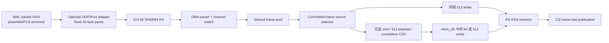

# 架构

数据路径由共享 segment stream、RX parser/channel match、frame pool、AXI4 write
engine、CQ writer 和 TX replay 组成。`slvc_dma_wrapper` 是通用集成顶层；
`frame_dma_wrapper` 是本次 FPGA OOC timing top。

RX 首先解析固定 64-byte SHDR64 header，再依据 channel metadata 进行 admission，
payload 写入目标 DDR ring。CQ body 先写入，owner/valid 最后可见，避免软件看到
部分完成记录。TX 根据 descriptor 从 DDR 读取 payload，并重新生成 SHDR64 segment。

carrier adapter 与 MCF endpoint 是边界模块：前者适配可选物理 carrier，后者可将
多个本地源汇聚为共享链路输入。二者不改变 DMA 的 DDR/CQ ownership 语义。

可选 `dma_udp_ipv4_to_shdr64_adapter` 是另一个 upstream boundary。它接收固定的
512-bit Ethernet II / IPv4 / UDP packet profile，构造 SHDR64 header，并从 byte 42
开始重新打包 payload。该模块不属于 `frame_dma_wrapper`，因此 frozen core FPGA OOC
结果不包含 adapter logic。

默认关闭的 RX memory 开发 profile 不改变上述前端。fixed ingress 或 shared pool
的 frame 到达现有 commit 点后，`dma_rx_ingress_source_selector` 锁定一个 512-bit
drain source。同频 512 直接进入 wide writer；async64/async512 则通过三条 FIFO
channel 跨越 command、有序 512-bit payload stream 和 tagged completion，完整 AXI
writer 保持在 `mem_clk`。原 64-bit AXI master 继续承担 CQ、TX read 和 legacy RX
traffic。详见[同频后端](rx_payload_512_backend.md)和
[双时钟后端](rx_payload_cdc_backends.md)。

