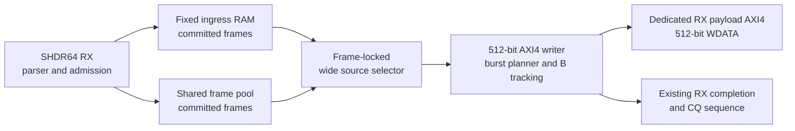

# 可选 512-bit RX Payload 后端

该开发 profile 为 RX payload 增加一条独立、同频的 512-bit AXI4 write master。
它不改变 SHDR64 解析、channel match、admission、ring 计账、frame-pool commit、
CQ publication、TX 或 descriptor 语义。冻结 release profile 仍默认使用原有
64-bit memory path。

## 数据路径边界



两个 ingress backend 都只在现有 commit 点之后，才以完整 frame 的
`TVALID/TREADY` stream 对后端可见。source selector 会锁定被选 backend，直到该
frame 完成。fixed ingress 直接读取已有 512-bit payload RAM；shared-pool 路径保留
已预取的首拍，再转发 pool drain stream。实现没有复制第二份完整 frame payload
存储。

writer 要求目标地址 64-byte 对齐，生成固定 `AWSIZE=6` 的 INCR burst；单个 burst
最多 16 beat，并在 4 KiB 边界拆分。最后一拍 `WSTRB` 由真实 payload length 生成。
AW、W、B 独立握手，最多维护四个有序 write response。只有所有已接受 burst 都收到
B response 后，才发布 frame completion。

## Profile 选择

该功能默认关闭，只有定义 `DMA_RX_WIDE_PAYLOAD_PROFILE` 时才编入
`frame_dma_rx_top`。公开 flow 通过 `configs/slvc_dma_512_rx_wide_defconfig` 选择：

```text
python3 flows/scripts/flowctl.py defconfig --source configs/slvc_dma_512_rx_wide_defconfig
python3 flows/scripts/flowctl.py show-config
python3 flows/scripts/flowctl.py sim-dry-run
python3 flows/scripts/flowctl.py fpga-ooc-dry-run
```

该 profile 执行 10 项 frozen-core regression 和 2 项 wide-backend test，不启用可选
UDP/IPv4 adapter test。

## 时钟与后续 CDC

当前实现要求 ingress、writer 和 dedicated AXI master 共用 `aclk`。command、
payload 和 completion 均保留显式 valid/ready 边界，后续异步 profile 可分别插入：

- command async FIFO；
- 512-bit payload async FIFO；
- completion async FIFO。

本轮没有实现 AXI CDC、512-to-64 转换、任意宽度 profile、非对齐首拍移位、TX/CQ
宽化或多端口 striping。
soft reset 沿用 core 现有的本地同步、破坏式 reset 合同；该 profile 没有为 burst
进行中触发 reset 的情况新增 external AXI transaction-drain protocol。

## 开发分支测量结果

独立 ModelSim/Questa test 覆盖 1 至 4096 byte 的全部长度、地址对齐与 4 KiB
边界、response error、随机 channel backpressure、reset/restart、2,000 个随机 frame
和 1 MiB throughput run。integration test 覆盖 18 个定向长度，以及 256 个混合
fixed-ingress/shared-pool frame。

理想 AXI memory model 下，1 MiB run 的 16,384 个 W beat 在 16,384 个 W-active
cycle 内完成，即 64 byte/cycle、W channel 利用率 100%、平均 burst 16 beat、峰值
outstanding 为 4。按 200 MHz 换算为 12.8 GB/s interface rate；这是 RTL/model
吞吐，不是真实 DDR 带宽实测。

Vivado 2018.3 在 `xc7z100ffg900-2` 上以 5.000 ns 对 `frame_dma_rx_top` 完成布局
布线：setup WNS `+0.059 ns`、TNS 0、hold WNS `+0.059 ns`、THS 0。资源为
37,874 LUT、42,365 FF、44 RAMB36、3 RAMB18、0 DSP。最终最差 setup path 已回到
已有 TX descriptor scheduler，而不是 wide writer。

writer-only Design Compiler OOC 使用 O-2018.06-SP1 和 Nangate45 typical library。
wide writer 在 5.000 ns 的 setup WNS 为 `+2.059 ns`，在 1.500 ns 为
`+0.013 ns`；首个测试失败点是 1.250 ns，setup WNS `-0.033 ns`。这是有界前端
综合 sweep，不是 routed ASIC Fmax 或 signoff。比较表和完整边界见
[已核验结果](results.md)。
