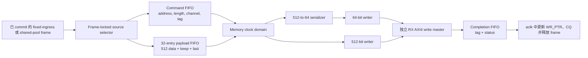

# 可选双时钟 RX Payload 后端

这些开发 profile 只把已经 commit 的 RX payload traffic 移入独立 memory clock
domain。SHDR64 解析、channel match、admission、frame storage、CQ publication、TX、
descriptor 以及冻结的公开 wrapper 均保持原有时钟关系和软件可见语义。

## Profile 矩阵

| Profile | RX memory clock | RX AXI WDATA | CDC 路径 | Defconfig |
| --- | --- | ---: | --- | --- |
| 冻结默认路径 | `aclk` | 64 bit | 无 | `slvc_dma_512_defconfig` |
| 同频 wide | `aclk` | 512 bit | generate bypass | `slvc_dma_512_rx_wide_defconfig` |
| Async64 | `mem_clk` | 64 bit | command + 512-bit payload + completion | `slvc_dma_512_rx_async64_defconfig` |
| Async512 | `mem_clk` | 512 bit | command + 512-bit payload + completion | `slvc_dma_512_rx_async512_defconfig` |

当前只实现上述两种离散 memory width，不是任意 64/128/256/512-bit 参数化。

## 数据路径与 Ownership

AXI AW、W、B 不会被拆开跨域。完整 writer 位于 `mem_clk`；跨域内容只有一个
frame command、有序 512-bit payload beat 和一个 completion。source 在匹配 tag 的
completion 返回前保持锁定，因此所有 B response 完成前不会释放 frame。

bridge 使用 8-bit transaction tag，当前一次只处理一个 frame。completion tag 不匹配
会转换为 error code 7，并锁存 protocol error。command/completion 使用 4-entry
Gray-pointer FIFO；payload 使用 32-entry、577-bit FIFO，保存 `TDATA`、`TKEEP` 和
`TLAST`。

## Memory-domain Writer

Async64 在 CDC 之后执行 `512 -> 64` serializer。它生成 `AWSIZE=3`，单个 burst
最多 16 beat，在 4 KiB 边界拆分，最多维护 4 个有序 response；memory model ready
时可持续每个 `mem_clk` 输出一个 64-bit W beat。

Async512 在 `mem_clk` 中复用 `dma_axi_write_engine_512`，生成 `AWSIZE=6`，要求
64-byte 对齐，并保持相同 burst、response 和 completion 规则。该 profile 允许完整
payload burst 到达 read side 之前先发 AW；W 仍严格服从 valid/ready。这样切断了
occupancy/4-KiB planning 的长组合锥，同时不放松 AXI 或 completion 顺序。

## Reset 合同

hard reset 在两个域中异步 assert、同步 deassert。当前 profile 要求 `aresetn` 和
`mem_aresetn` 同时 assert；不支持任意单边 hard-reset recovery，并由仿真检查。

集成顶层对 soft reset 使用 quiesce-and-drain。异步 payload transaction 活跃时收到的
请求会被记住，不立即破坏 core 状态；只有 payload 传输、全部 AXI B response、tagged
completion 和 source-side release 都结束后才执行 reset。随后该 idle reset event 同步
进入 `mem_clk`。若 soft reset 在任一侧仍 busy 时到达，bridge assertion 会报错。

## 技术映射

`dma_async_fifo_tech` 是统一边界。Vivado OOC 对 32-entry payload FIFO 选择 XPM，
从而映射为 block RAM；4-entry command/completion FIFO 使用已验证的通用 Gray-pointer
实现，因为 Vivado 2018.3 XPM 要求更深 FIFO。仿真和 ASIC OOC 使用 generic RTL array。

建模 storage 总量为 18,948 bit。Design Compiler 会把这些 generic array 计入标准单元
面积，因此该结果不能与 macro-backed ASIC 实现或同频 writer-only 结果直接比较。

## 验证与测量结果

每个异步 profile 调度 10 项 frozen-core test 和 3 项 backend test。公共 bridge test
覆盖 450 个 frame、6 种 clock profile、clock stop、FIFO full/empty 压力、tag 计账和
924,873 byte。每个 backend test 覆盖 2,000 个随机 frame，以及定向长度、4 KiB 拆分、
AW/W/B backpressure、response error、reset/restart 和 byte-accurate memory comparison。
integration test 覆盖 18 个定向长度、256 个混合 source frame 和 active soft-reset drain。

理想 1 MiB 测试结果：

| Profile | AXI byte/cycle | W 利用率 | Peak outstanding | 200 MHz interface rate |
| --- | ---: | ---: | ---: | ---: |
| Async64 | 8 | 100% | 4 | 1.6 GB/s |
| Async512 | 64 | 100% | 4 | 12.8 GB/s |

这些是 RTL/model interface rate，不是板级 DDR 实测。

Vivado 2018.3 在 `xc7z100ffg900-2` 上以 5.000 ns `aclk` 和 `mem_clk` 完成
`frame_dma_rx_top` routed OOC：

| Profile | WNS | TNS | WHS | THS | LUT | FF | RAMB36 | RAMB18 | DSP |
| --- | ---: | ---: | ---: | ---: | ---: | ---: | ---: | ---: | ---: |
| 同频 512 | +0.029 ns | 0 | +0.052 ns | 0 | 38,595 | 42,492 | 44 | 3 | 0 |
| Async64 | +0.028 ns | 0 | +0.069 ns | 0 | 39,471 | 43,586 | 52 | 4 | 0 |
| Async512 | +0.076 ns | 0 | +0.051 ns | 0 | 39,155 | 43,306 | 52 | 4 | 0 |

同频 netlist audit 的 RX payload CDC cell 数为 0。两个异步 profile 均无未约束内部
endpoint、无 Critical CDC entry，所有 Gray-pointer bus-skew constraint 均通过。
Vivado 仍会对已识别的 Gray bus 和 clock-enabled FIFO data 报结构型 CDC warning；
这些是已记录结构，不等价于 blanket CDC signoff waiver。

Design Compiler 5.000 ns OOC 结果：

| Profile | Source WNS | Memory WNS | Hold WNS | Cell area | Register | FIFO model |
| --- | ---: | ---: | ---: | ---: | ---: | --- |
| Async64 | +2.933 ns | +1.686 ns | +0.039 ns | 171,658.05 | 20,554 | 已计入 generic array |
| Async512 | +2.963 ns | +1.393 ns | +0.039 ns | 170,311.29 | 20,457 | 已计入 generic array |

这是 frontend OOC synthesis，不是 physical implementation、extracted STA、SRAM macro
characterization 或 ASIC signoff。

## 明确限制

- TX、CQ、descriptor 和 AXI4-Lite traffic 仍位于原时钟域；
- frame 按顺序完成，不支持多 frame 乱序 completion；
- Async512 地址要求 64-byte 对齐，Async64 至少 8-byte 对齐；
- 不声明单边 hard-reset recovery、任意 memory width、非对齐首拍移位、多端口
  striping 或板级 DDR throughput。
